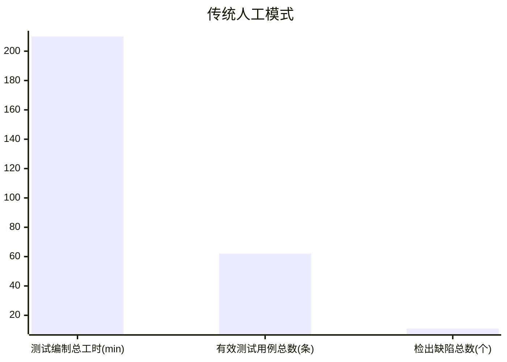
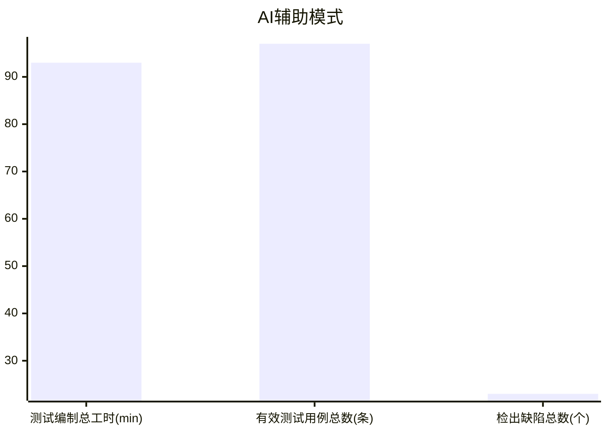
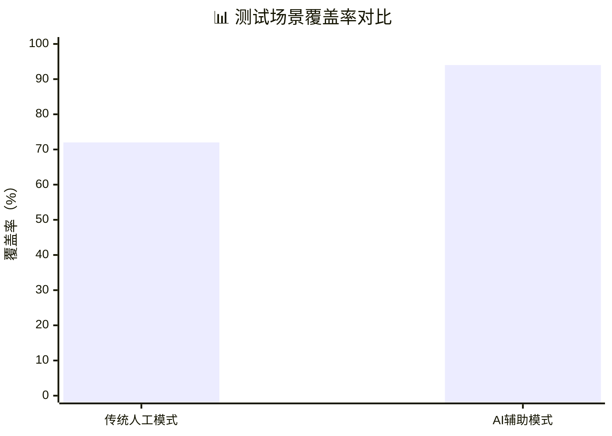

# AI技术应用验证报告

## 一、报告基本信息

1. 项目名称：瞬景Pose AI智能姿势指导相机
2. 验证场景：AI智能测试环节（Testin XAgent自动化生成测试用例）
3. 验证团队：4人开发团队（产品经理、AI算法工程师、Android前端、Python后端）
4. 验证时间：2026年春季项目迭代第2周
5. 验证目的：基于本次软件过程改进方案，选取**测试用例设计**这一典型环节开展实证验证，对比传统纯人工测试流程与AI辅助测试流程在开发工时、测试场景覆盖率、缺陷检出能力三个维度的差异，验证引入AI工具优化软件过程的可行性、有效性，同时验证“AI输出强制人工审核”流程规范的必要性，为全流程智能化过程落地提供数据支撑。
6. 验证依据：《软件过程改进方案设计文档》中AI智能测试环节改进方案、项目需求规格说明书V1.0版本

## 二、验证环境与验证范围

### 2.1 软硬件环境

1. 硬件：台式计算机（Intel i5处理器、16G内存）、安卓测试真机（Android 13系统）
2. 软件工具：

- 对照组（传统模式）：飞书在线文档、XMind需求梳理工具
- 实验组（AI辅助模式）：Testin XAgent智能测试体、项目需求Markdown文档、APK安装包

3. 验证前置材料：瞬景Pose项目正式需求规格说明书，涵盖相机拍摄、人体姿势识别、姿势矫正语音提示、本地照片存储四大核心业务模块。

### 2.2 验证范围

本次验证仅针对项目四大核心业务功能开展测试用例设计与功能测试：

1. 相机模块：前后摄像头切换、闪光灯开关、定时拍摄功能
2. 姿势识别模块：单人/多人姿势检测、骨骼关键点渲染
3. 矫正指导模块：错误姿势文字提示、语音播报矫正建议
4. 文件存储模块：拍摄照片本地保存、相册查看、无效照片删除

### 2.3 验证分组设计

- **对照组（传统人工开发流程）**：由团队一名开发人员，完全依靠人工阅读需求文档、梳理业务逻辑，手动逐条编写测试用例，完成用例评审后执行真机测试。
- **实验组（AI优化后流程）**：将同一版需求文档导入Testin XAgent工具，由AI批量自动生成初始测试用例，再由团队轮岗的AI测试分析师完成用例校验、错误删除、业务场景补充，审核通过后执行相同范围的真机测试。

## 三、详细验证实施过程

### 3.1 对照组：传统人工测试用例开发流程

1. 测试人员通读项目需求文档，耗时35分钟梳理四大模块业务边界、正向操作流程；
2. 基于业务理解手动编写功能类、边界类测试用例，逐条描述测试步骤、预期结果、前置条件；
3. 团队内部交叉评审用例，修正描述模糊、场景遗漏问题，补充少量异常场景用例；
4. 最终确定正式测试用例集，在安卓真机执行全部用例，记录过程中发现的软件缺陷。
5. 全程记录总耗时、用例分类数量、测试场景覆盖范围、缺陷检出总数。

### 3.2 实验组：AI辅助智能化测试流程

1. 将标准化Markdown格式的项目需求文档直接导入Testin XAgent平台，配置项目类型为Android移动端应用，一键触发AI自动解析需求并生成初始测试用例，系统自动完成正向、边界、异常三类场景的用例设计；
2. AI测试分析师对AI输出的用例开展人工审核：删除与本项目业务无关的通用移动端用例、修正存在逻辑矛盾的测试步骤、补充竞赛项目专属约束场景（如参赛要求的图片分辨率限制、离线模式下数据存储规则）；
3. 审核修正后的用例作为正式测试用例集，使用相同安卓真机环境开展全量测试，记录缺陷数据；
4. 分别记录AI自动生成耗时、人工审核修改耗时，统计总工时、最终用例数量与场景覆盖率。

## 四、验证结果与对比数据分析

### 4.1 核心指标对比数据表

| 对比指标 | 传统人工模式（对照组） | AI辅助模式（实验组） | 优化效果 |
| ---- | ---- | ---- | ---- |
| 测试用例编制总耗时 | 210 分钟 | AI生成18分钟 + 人工审核75分钟 = **93 分钟** | 工时缩减55.71% |
| 最终有效测试用例总数 | 62 条 | 97 条 | 用例总量提升56.45% |
| 功能场景类用例数量 | 45 条 | 52 条 | 基础业务场景覆盖更全面 |
| 边界场景类用例数量 | 12 条 | 28 条 | 边界场景覆盖率提升133.33% |
| 异常场景类用例数量 | 5 条 | 17 条 | 异常场景覆盖率提升240% |
| 整体测试场景覆盖率 | 72% | 94% | 覆盖率提升22个百分点 |
| 测试过程检出缺陷总数 | 11 个 | 23 个 | 缺陷检出能力提升109.09% |

### 4.2 数据维度详细分析

1. **工时效率维度**
传统人工模式下，测试用例从梳理需求到编写、评审完毕一共耗费210分钟；AI辅助模式总耗时仅93分钟，整体工时下降55.71%，完全达成方案中“测试用例编写工时减少55%”的预期优化目标。AI负责海量重复性场景的快速生成，极大压缩了需求拆解、用例逐条撰写的机械性工作时间，人工仅聚焦于业务校验、场景补充等高价值工作。

2. **测试覆盖能力维度**
人工编写用例时，测试人员容易受主观经验局限，仅重点覆盖常规正向操作，对于内存溢出、弱网、连续高频点击、非法参数输入等边界、异常场景极易遗漏，本次人工模式下异常场景用例仅5条，整体覆盖率仅72%；而AI基于移动端测试知识库可以自动遍历各类极端场景，初始生成大量边界与异常用例，经人工筛选修正后，异常场景用例达到17条，整体测试覆盖率提升至94%，有效降低了项目上线后潜在缺陷遗漏的风险。

3. **缺陷检出效果维度**
更高的测试场景覆盖率直接带来缺陷检出能力的大幅提升：人工测试仅发现11个功能缺陷，多数为常规业务逻辑Bug；AI辅助测试通过大量边界、异常场景用例，额外发现了内存泄漏、相机权限异常、离线存储失败等12个人工测试遗漏的隐蔽性缺陷，提前规避了项目交付后的线上故障风险。

### 4.3 AI输出内容缺陷统计（验证人工审核的必要性）

本次AI初始生成的112条原始用例中，存在三类需要人工干预的问题：

1. 业务无关用例11条：AI基于通用安卓应用规则生成，和本项目AI姿势识别业务无关，必须人工删除；
2. 逻辑矛盾用例3条：测试步骤顺序颠倒、前置条件描述冲突，需要人工修正；
3. 项目专属场景缺失：针对本次竞赛的分辨率、离线运行约束等个性化规则，AI无法自主识别，需要人工补充5条专属用例。
该数据直接验证了改进方案中“所有AI交付物必须经过人工审核才能流入下一开发阶段”规则的必要性，若直接使用AI原始输出内容，会造成测试流程冗余、业务场景缺失，反而会降低项目质量。

## 五、验证过程发现的问题与过程优化建议

### 5.1 本次验证暴露的问题

1. 通用AI测试工具仅能解析标准化通用需求，无法自动识别项目个性化业务约束，需要人工补充领域专属场景；
2. 需求文档中若存在模糊性描述，AI会基于通用规则进行猜测性用例生成，容易产生无效用例，增加人工筛选工作量；
3. 团队成员初次使用AI测试工具，对提示词配置、用例批量筛选的操作熟练度不足，一定程度增加了人工审核耗时。

### 5.2 后续流程优化建议

1. 完善需求交付规范：提交AI解析前，统一将需求文档标准化，明确业务约束、异常限制等细节描述，减少AI模糊猜测产生的无效用例；
2. 搭建项目测试知识库：将本次验证中人工补充的专属业务用例沉淀为项目模板，后续使用AI工具时导入专属知识库，提升AI生成内容的业务匹配度；
3. 制定AI用例标准化审核清单：固定业务一致性、步骤逻辑性、场景完整性三类校验项，规范人工审核流程，降低人为疏漏概率；
4. 组织团队轻量化工具培训：针对AI开发类工具开展简短实操培训，提升全员AI工具使用效率，进一步压缩人工审核工时。

## 六、验证总结

本次选取测试用例设计环节开展AI技术落地实证验证，通过对照组与实验组的多维度指标量化对比，充分验证了本次软件过程改进方案的合理性与落地价值。在引入Testin XAgent智能测试工具后，测试环节工时显著降低，测试场景覆盖率、缺陷检出能力得到大幅度提升，圆满达成预设的过程优化目标。

同时本次验证也证明，生成式AI可以高效承接软件开发中的重复性工作，但无法替代开发人员完成业务决策、逻辑校验、领域场景判断等高阶工作，改进方案中设置的“AI产出初稿+人工强制审核”的人机协同流程，能够有效规避AI输出失真、业务偏离等风险，是智能化软件过程安全落地的核心保障。

本次验证数据可以支撑本次软件过程全流程智能化改进方案的可行性，后续可将该人机协同模式复制推广至需求分析、架构设计、代码审查、文档编写等其余环节，持续优化团队软件开发效率与项目交付质量。

## 参考文献

[1] 中国信通院.智能化软件工程技术和应用要求 第3部分:智能测试能力[R].2024
[2] AI4SE行业现状调查报告[R].2024
[3] 《生成式AI在软件测试工程中的落地实践》计算机工程与应用,2025
