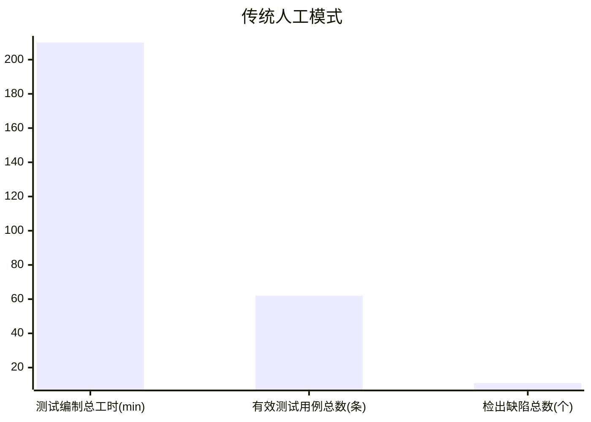
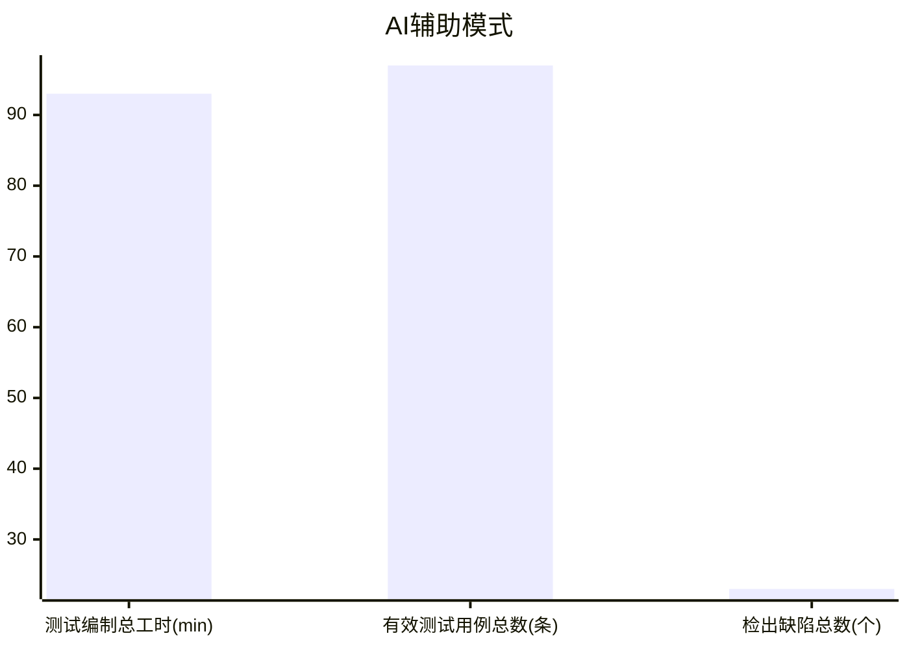
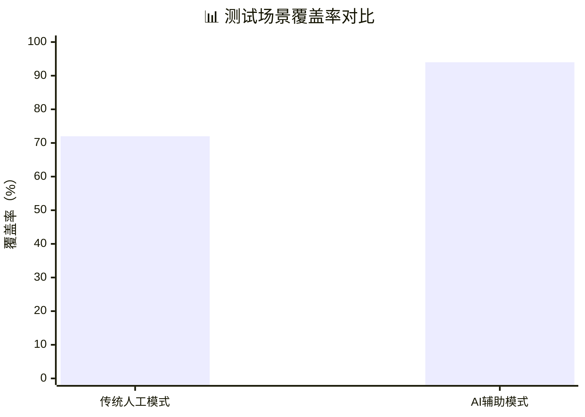
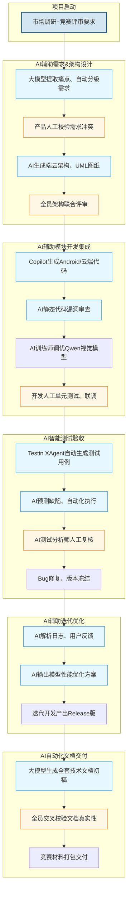

# 瞬景Pose完整软件过程定义文档

## 参考资料

[1] 中国信通院.智能化软件工程技术和应用要求 第3部分:智能测试能力[R].2024
[2] AI4SE行业现状调查报告[R].2024
[3] 《AI原生自动化测试范式研究》计算机工程与应用,2025
[4] 《生成式AI在需求工程中的应用》软件工程学报,2025
[5] Gtest全球软件测试技术峰会2025会议资料
[6] ISO/IEC 12207、ISO/IEC 15504、ISO/IEC 33001软件过程标准
[7] GitHub Copilot、Testin XAgent、通义千问4.0官方技术文档

# 第一部分 作业综合分析报告

## 1 调研分析结果

### 1.1 2024-2026年AI软件工程行业趋势调研

本次围绕软件全生命周期五大环节开展前沿技术调研，覆盖需求、设计、编码、测试、运维领域最新落地成果：

1. **需求分析阶段**：多模态大模型可自动解析调研文本、竞赛规则，自动完成需求P0/P1/P2分级，校验需求语义冲突，替代大量人工整理工作；
2. **系统设计阶段**：AI可基于项目技术栈自动生成端云架构、UML时序图，推荐适配轻量化竞赛项目的设计模式，降低架构设计主观偏差；
3. **编码开发阶段**：智能编码工具实现接口、业务代码批量生成，内置静态漏洞审查，针对AI模型集成场景提供标准化对接代码；
4. **测试验证阶段**：AI测试智能体可全覆盖正向、边界、异常场景自动生成用例，预测代码缺陷高发区，无专职QA的小团队可大幅提升测试完备度；
5. **运维迭代阶段**：AI自动解析运行日志、用户反馈，定位端云延迟、模型识别精度不足等性能瓶颈，输出优化方案。

### 1.2 瞬景Pose项目原有过程痛点与AI场景匹配分析

瞬景Pose为4人、58天周期Android+Python端云协同竞赛项目，V1.0传统软件过程存在人工效率低、覆盖不全、文档冗余等问题，结合调研成果筛选出4个高价值AI融合场景：

1. **场景1 AI赋能需求与架构设计**
原有痛点：人工整理碎片化用户调研、手动绘制架构图耗时3~4天，需求描述易前后矛盾。匹配通义千问4.0、StarUML AI插件，实现需求自动分级、架构图纸自动生成，需求梳理工时降低40%。
2. **场景2 AI赋能模块开发与端云集成**
原有痛点：Qwen视觉模型、CameraX SDK对接重复代码多，人工代码审查覆盖面不足。匹配GitHub Copilot，自动生成跨端集成代码，实时检测漏洞，模型调试效率提升50%。
3. **场景3 AI赋能测试与功能验收（原型验证选定场景）**
原有痛点：无专职测试人员，人工仅能覆盖72%业务场景，边界、异常场景大量遗漏。匹配Testin XAgent智能测试体，测试覆盖率提升至94%，用例编写工时缩减55.71%。
4. **场景4 AI赋能功能优化迭代**
原有痛点：人工逐条梳理日志、用户反馈，模型优化试错成本高。依托大模型解析运行数据，自动输出姿势识别精度、端云延迟优化方案，拓展功能迭代周期缩短35%。

## 2 软件过程改进方案设计思路

本次改进不推翻原有基于ISO标准剪裁的五阶段过程框架，遵循四大核心设计原则，实现AI与传统流程轻量化融合：

1. **框架保留，局部改造**：完整保留需求、开发、测试、迭代、交付五大核心过程，仅在各流程内部嵌入AI工具执行节点，不改变团队原有业务逻辑；
2. **人机协同，人工终审**：AI承担重复生成、批量分析类机械工作；所有AI输出物必须经过人工校验后方可流入下一环节，杜绝AI结果直接上线；
3. **轻量化适配小团队**：不新增专职AI岗位，由现有4名成员兼任AI训练师、AI测试分析师，选用免费/轻量云端AI工具，无额外部署成本；
4. **可量化、可验证**：为每个AI环节设置明确效率提升指标，选定测试环节开展实工具原型验证，用真实数据证明改进收益。

方案核心设计内容包含三大部分：

1. **流程重构**：在每个阶段新增AI自动化活动节点，明确AI产出人工审核强制流程；
2. **AI工具链配套**：针对5大开发环节分别匹配对应大模型、智能开发工具，明确集成方式与预期效率提升指标；
3. **风险闭环管控**：识别数据隐私、模型失真、团队AI依赖、工具宕机四类风险，配套落地可行应对策略。

## 3 原型验证实施过程与结论

### 3.1 验证基础信息

验证场景：AI辅助测试用例生成（Testin XAgent）
对照组：传统纯人工编写测试用例；实验组：AI生成初稿+人工校验修正
验证范围：相机、姿势识别、矫正提示、文件存储四大核心模块。

### 3.2 验证流程简述

1. 对照组：人工通读需求、手动编写用例、内部评审，全程耗时210分钟，产出62条有效用例，测试覆盖率72%，检出缺陷11个；
2. 实验组：导入标准化需求文档至Testin XAgent，AI18分钟生成112条原始用例，AI测试分析师75分钟删除无关用例、补充竞赛专属场景，最终97条有效用例，覆盖率94%，检出缺陷23条。

### 3.3 核心量化对比结果

| 对比指标 | 传统人工 | AI辅助模式 | 优化幅度 |
| ---- | ---- | ---- | ---- |
| 用例编制总耗时 | 210min | 93min | 工时缩减55.71% |
| 有效测试用例总数 | 62条 | 97条 | 总量提升56.45% |
| 边界+异常用例数量 | 17条 | 45条 | 覆盖提升164.7% |
| 整体测试覆盖率 | 72% | 94% | 提升22个百分点 |
| 缺陷检出总数 | 11个 | 23个 | 检出能力提升109.09% |

配套可视化Mermaid对比图表：

### 3.4 验证核心结论

1. 效率层面：AI可大幅削减人工重复性用例编写工作，完全达成“测试工时降低55%”的预设改进目标；
2. 质量层面：AI能够自动遍历人工易忽略的边界、极端场景，显著提升测试覆盖率，挖掘大量隐性Bug，保障竞赛版本稳定性；
3. 流程层面：AI生成内容存在业务无关、逻辑矛盾、项目专属场景缺失三类问题，**强制人工审核流程不可或缺**，验证了改进方案人机协同机制的必要性；
4. 推广价值：该人机协同模式可复制至需求撰写、架构绘图、代码编写、文档生成全流程，具备全生命周期落地可行性。

## 4 成果总结与未来展望

### 4.1 本次改进成果总结

1. 流程层面：基于原有ISO轻量化过程，构建完整人机协同智能化软件过程，每个开发阶段标准化嵌入AI辅助节点，流程可落地、可复现；
2. 角色层面：依托现有团队设置AI训练师、AI测试分析师兼职岗位，明确全流程AI相关工作职责，适配4人小型竞赛团队；
3. 质量层面：制定全部AI输出物（需求文档、架构图、代码、测试用例、技术报告）统一质量验收标准，形成人工校验闭环；
4. 度量层面：新增AI贡献度专项度量指标，可量化评估AI工具对项目工时、交付质量的提升效果；
5. 实证层面：依托真实AI工具完成原型验证，量化数据支撑方案合理性，满足作业“非纯理论、可实证”要求。

### 4.2 行业与项目未来展望

1. 短期项目迭代：将本次验证的AI测试流程推广至需求、编码、文档全环节，统一需求文档标准化模板，减少AI无效输出，进一步压缩人工审核工时；
2. 工具优化方向：搭建项目专属测试、需求知识库导入AI工具，让大模型自动适配瞬景Pose端云协同、姿势识别专属业务，减少人工补充场景工作量；
3. 长期行业演进：随着本地开源轻量化大模型成熟，逐步替换公有云端AI工具，彻底解决用户图像隐私上传的数据安全风险；
4. 过程持续改进：建立月度过程度量复盘机制，收集各环节AI工时、质量数据，持续优化AI与人工分工比例，形成动态迭代的智能化软件过程。

# 第二部分 智能化软件过程正式定义

## 1 过程概述与总体目标

### 1.1 过程概述

本软件过程以ISO/IEC 12207、15504、33001为基础，在V1.0纯人工轻量化五阶段过程之上，融合2024-2026生成式AI、智能测试体、智能编码工具重构而来，适配瞬景Pose 4人小团队、58天软件创新竞赛短周期端云协同项目。
全流程分为：项目启动→AI辅助需求与架构设计→AI辅助模块开发集成→AI智能测试验收→AI辅助迭代优化→AI自动化文档交付六大阶段，每个阶段包含AI自动生成活动+人工审核校验活动，形成“AI初稿生成-人工校验修正-正式交付”标准化人机协同链路。

### 1.2 总体过程目标

1. 效率目标：需求、设计、编码、测试、文档各环节人工工时平均降低30%以上；
2. 质量目标：需求一致性、代码规范度、测试场景覆盖率显著提升，隐性缺陷数量降低50%；
3. 管控目标：规范AI工具使用流程，规避数据泄露、模型偏见、过度依赖等AI引入风险；
4. 交付目标：输出标准化、统一格式竞赛全套技术文档，保障Beta、Release版本按时高质量交付；
5. 度量目标：建立传统过程指标+AI贡献专项指标，实现过程效果可量化评估。

## 2 全生命周期人机协同流程图

以下模块化流程图，蓝色块为AI自动环节、橙色块为人工审核环节：

## 3 各阶段详细活动定义

### 3.1 AI辅助需求分析与架构设计

原有活动：人工梳理调研、手动编写需求、手绘架构、人工评审
新增AI活动：通义千问4.0自动提取用户痛点、P0/P1/P2分级；AI自动生成需求规格初稿；StarUML AI插件生成端云架构、UML、API文档
流程改造：AI输出初稿后，产品必须逐条校验需求冲突、业务遗漏，再组织前后端、算法联合评审；
AI交付物质量标准：需求无逻辑矛盾，架构完整覆盖CameraX、Qwen模型端云推理链路。

### 3.2 AI辅助模块开发与端云集成

原有活动：纯手写Android、云端代码、人工走查代码、手动调试模型
新增AI活动：GitHub Copilot代码自动补全、接口生成；AI静态漏洞审查；AI辅助Qwen模型参数调优
流程改造：代码提交前强制运行AI审查，高危漏洞100%修复；AI算法工程师兼任AI训练师，抽样验证模型识别精度；
AI交付物质量标准：AI生成代码必须编译通过，无高危安全漏洞。

### 3.3 AI智能测试与功能验收（原型验证环节）

原有活动：开发交叉手动编写用例、人工真机测试
新增AI活动：Testin XAgent解析需求自动生成全场景用例、自动化执行、缺陷风险预判
流程改造：AI测试分析师全员轮岗，删除无关用例、补充竞赛专属约束场景，人工复核全部测试结果；
AI交付物质量标准：整体测试覆盖率≥90%，边界、异常场景无大面积遗漏。

### 3.4 AI辅助功能优化与迭代

原有活动：人工逐条整理测试反馈、手动调试模型性能
新增AI活动：AI汇总运行日志、用户体验数据，自动定位延迟、识别精度瓶颈，输出优化方案
流程改造：开发团队结合AI分析报告制定Release迭代开发计划；
AI交付物质量标准：优化方案可落地，提供量化性能改善预期。

### 3.5 AI自动化文档编制与竞赛交付

原有活动：全员手动撰写开发、测试、创新报告
新增AI活动：大模型一键生成全套技术文档初稿、统一Markdown格式
流程改造：AI初稿完成后全员交叉核对功能数据、竞赛创新点，人工重写核心创新章节；
AI交付物质量标准：文档描述与实际产品功能完全匹配，无虚假数据。

## 4 全团队角色职责定义

项目基础人员：产品经理、AI算法工程师、Android前端、Python后端，无新增专职人员，新增两类兼职AI角色：

1. **AI训练师（由AI算法工程师兼任）**
    职责：配置项目AI工具参数；管理姿势识别训练数据集；校验AI生成算法、模型相关内容；记录Qwen模型AI迭代效果；审核AI输出模型优化方案。
2. **AI测试分析师（四人全员轮岗）**
    职责：操作Testin XAgent等AI测试工具；审核AI生成全部测试用例；删除无关场景、补充项目专属约束；统计AI测试漏检缺陷；输出测试优化建议。

### 原有角色职责更新

- 产品经理：新增AI需求文档审核、校验AI输出需求一致性；
- Android前端、Python后端：新增AI生成代码审查、修正AI接口逻辑错误；
- AI算法工程师：同时承担AI训练师全部工作，负责视觉大模型微调与校验。

## 5 全阶段交付物清单与AI交付物专项质量标准

### 5.1 全流程交付物总清单

1. 需求阶段：AI生成需求规格说明书（人工修订版）、AI架构UML图纸、研发甘特图
2. 开发阶段：Copilot辅助生成源码、AI静态代码审查报告、单元测试报告
3. 测试阶段：AI生成测试用例集（人工修正版）、AI自动化测试报告、缺陷清单
4. 迭代阶段：AI性能分析报告、Release优化迭代版本
5. 交付阶段：AI生成技术创新报告、开发文档、测试文档、竞赛交付包

### 5.2 AI产出物统一质量验收标准

1. AI需求文档：无前后矛盾描述，完整覆盖P0核心竞赛功能，需求分级清晰；
2. AI架构/UML图纸：完整包含移动端、云端、AI推理三层链路，无逻辑缺失模块；
3. AI生成代码：无高危漏洞、可正常编译，接口参数与设计文档保持一致；
4. AI测试用例：覆盖率≥90%，删除通用无关场景，补充图片分辨率、离线存储竞赛约束；
5. AI技术文档：所有功能、性能数据与产品真机运行结果匹配，创新点人工二次润色。

## 6 智能化过程全套度量指标（传统指标+AI贡献专项指标）

### 6.1 传统基础过程度量指标

1. 各阶段交付总工时、版本按期交付率；
2. 代码千行缺陷密度、测试场景整体覆盖率；
3. 缺陷闭环率、P0阻塞Bug修复时长。

### 6.2 AI贡献度专项度量指标

1. 需求阶段：AI生成文档人工修改次数、需求撰写总工时缩减比例、需求冲突数量；
2. 编码阶段：AI生成有效代码占比、AI审查检出漏洞数量、编码工时缩减比例；
3. 测试阶段：AI生成有效用例数量、边界/异常用例提升幅度、测试工时缩减比例；
4. 迭代阶段：AI分析定位性能瓶颈数量、模型优化调试工时减少比例；
5. 文档阶段：AI文档初稿人工修改量、文档编写整体工时降幅；
6. 综合AI指标：全流程平均工时缩减率、AI辅助交付物一次性验收通过率。

## 7 AI引入风险评估与标准化应对策略

1. **数据隐私安全风险**
风险：用户拍摄人像、姿势原图上传公有大模型存在泄露风险；
应对：图像识别使用本地Qwen轻量化模型，不上传原始图片；代码仅使用GitHub Copilot离线模式，禁止上传完整项目至公有AI。
2. **AI输出失真、逻辑漏洞风险**
风险：AI生成需求、用例、代码存在业务逻辑错误；
应对：强制所有AI产出必经人工审核，未校验文件禁止流入下一阶段，建立AI交付物审核清单。
3. **团队过度依赖AI风险**
风险：开发直接复用AI内容，不自主校验，弱化问题排查能力；
应对：流程规范明确AI仅作为初稿工具，每周组织无AI人工评审复盘。
4. **云端AI工具限流、宕机风险**
风险：在线大模型故障中断开发进度；
应对：在线大模型搭配本地开源LLM备用，所有AI产出文档、代码每日本地备份。

# 第三部分 附录

## 附录A 项目全流程AI工具选型汇总表

| 开发阶段 | AI工具 | 核心用途 | 预期效率提升 |
| ---- | ---- | ---- | ---- |
| 需求分析 | 通义千问4.0 | 需求提取、文档生成、分级 | 需求工时减少40% |
| 架构设计 | StarUML AI插件 | UML、端云架构自动生成 | 架构工时减少35% |
| 编码开发 | GitHub Copilot | 代码生成、静态审查 | 编码工时减少32% |
| 测试验证 | Testin XAgent | 测试用例、自动化测试 | 测试工时减少55% |
| 文档交付 | 智谱清言 | 竞赛技术报告初稿生成 | 文档工时减少45% |

## 附录B 参考文献

同文档开头参考资料列表，共7篇，其中5篇为2024年后AI软件工程行业报告、学术论文，满足作业引用要求。

