# 瞬景Pose项目软件过程改进方案设计文档

## 文档基础信息

1. **项目名称**：瞬景Pose AI智能姿势指导相机
2. **团队规模**：4人（产品、AI算法、Android前端、Python后端）
3. **原过程依据**：ISO/IEC 12207、ISO/IEC 15504、ISO/IEC 33001轻量化剪裁软件过程
4. **编写目的**：针对瞬景Pose原有5阶段软件全生命周期过程，融入2024-2026生成式AI、智能体技术重构开发流程，设计人机协同智能化开发方案，解决传统人工开发效率低、需求不一致、测试覆盖不全、文档编写耗时等痛点，形成可落地的AI赋能软件过程改进体系。
5. **参考资料**
    [1] 中国信通院.智能化软件工程技术和应用要求 第3部分:智能测试能力[R].2024
    [2] AI4SE行业现状调查报告[R].2024
    [3] 《AI原生自动化测试范式研究》计算机工程与应用,2025
    [4] 《生成式AI在需求工程中的应用》软件工程学报,2025
    [5] Gtest全球软件测试技术峰会2025会议资料

## 一、原有软件过程现状与核心痛点

原项目基于短周期竞赛场景剪裁出5大核心过程：需求分析与架构设计、模块开发与端云集成、测试与功能验收、功能优化与迭代、文档编制与竞赛交付。结合4人小团队、无专职QA/运维、58天紧凑工期、AI模型驱动的产品特性，传统人工流程存在明显短板：

1. **需求分析阶段**：人工整理用户调研、竞赛要求，手动编写需求规格书，需求点易遗漏、前后描述不一致，需求分级全靠人工梳理，耗时约3-4个工作日。
2. **系统架构设计阶段**：人工手绘架构图、UML交互图、API文档，反复修改迭代成本高，缺少设计模式智能推荐，端云协同数据流易出现逻辑漏洞。
3. **编码开发阶段**：AI模型接口、Android相机模块代码全部手写，重复逻辑代码冗余，人工代码审查覆盖不全，模型集成调试耗时久。
4. **测试验收阶段**：纯人工编写功能测试用例，边界场景、异常场景覆盖不足；Bug人工复现定位慢，无自动化缺陷预测手段，阻塞性缺陷遗漏风险高。
5. **迭代优化阶段**：用户反馈、性能日志人工逐条分析，AI姿势识别效果优化依赖人工试错，无法自动定位响应延迟、识别精度差等根因。
6. **文档交付阶段**：竞赛技术报告、开发手册、测试文档全部手动撰写，格式不统一，大量重复描述，校验工作量大。

基于以上痛点，本次改进选取**需求分析、架构设计、编码开发、自动化测试、项目文档编制**5个高价值环节引入AI技术重构流程。

## 二、AI融合过程改进总体方案思路

1. **过程框架保留**：不推翻原有5阶段生命周期架构，仅在各流程内部新增AI工具执行节点、人工校验节点，适配团队原有工作习惯。
2. **人机协同原则**：AI负责批量生成、辅助分析、重复劳动；人负责决策校验、业务逻辑审核、AI输出质量把关，杜绝AI结果直接上线。
3. **轻量化适配小团队**：不引入重型AI平台，选用轻量化云端大模型、免费开源AI开发工具，无需新增专职人员，现有角色兼任AI相关岗位。
4. **可度量改进目标**：各环节人工工时降低30%以上，需求一致性、测试用例覆盖率、代码规范性显著提升。

## 三、全生命周期软件过程重构（含AI节点流程图）

### 3.1 智能化软件过程流程图（Mermaid）

```mermaid

flowchart TD
    %% 全局链接默认样式
    linkStyle default stroke:#666,stroke-width:1.2

    %% 节点样式类定义
    classDef stage fill:#d4e6f1,stroke:#1f618d,stroke-width:2px,color:#000
    classDef aiNode fill:#e6f7ff,stroke:#1890ff,stroke-width:1.2px,color:#000
    classDef humanNode fill:#fff7e6,stroke:#fa8c16,stroke-width:1.2px,color:#000

    %% ========== 项目启动 ==========
    subgraph startPhase["🚀 项目启动"]
        direction TB
        A([项目启动：市场调研+竞赛评审要求]):::stage
    end

    %% ========== 需求分析阶段 ==========
    subgraph reqPhase["📋 需求分析阶段"]
        direction TB
        B([AI辅助需求分析过程]):::stage
        B --> B1[大模型批量提取用户痛点]
        B1 --> B2[AI生成需求初稿+P0/P1/P2分级]
        B2 --> B3[产品人工校验需求一致性]
        B3 --> B4[输出AI标准化需求规格说明书]
    end

    %% ========== 架构设计阶段 ==========
    subgraph archPhase["🏗️ 架构设计阶段"]
        direction TB
        C([AI驱动架构设计过程]):::stage
        C --> C1[AI生成端云架构图、UML时序图]
        C1 --> C2[AI推荐视觉项目适配设计模式]
        C2 --> C3[前后端+算法联合架构评审]
        C3 --> C4[输出API文档、完整架构设计稿]
    end

    %% ========== 开发集成阶段 ==========
    subgraph devPhase["⚙️ 开发集成阶段"]
        direction TB
        D([AI辅助模块开发与端云集成]):::stage
        D --> D1[GitHub Copilot代码生成、接口补全]
        D1 --> D2[AI静态代码审查，识别漏洞冗余]
        D2 --> D3[AI训练师调优Qwen视觉模型]
        D3 --> D4[端云联调+人工单元测试]
    end

    %% ========== 测试验收阶段 ==========
    subgraph testPhase["🧪 测试验收阶段"]
        direction TB
        E([AI智能测试与功能验收]):::stage
        E --> E1[Testin XAgent批量生成测试用例]
        E1 --> E2[AI自动化执行+潜在缺陷预测]
        E2 --> E3[全员轮岗AI测试分析师复核结果]
        E3 --> E4[Bug修复+版本冻结]
    end

    %% ========== 迭代优化阶段 ==========
    subgraph iterPhase["🔄 迭代优化阶段"]
        direction TB
        F([AI辅助功能优化迭代]):::stage
        F --> F1[AI智能解析性能日志、用户反馈]
        F1 --> F2[AI输出模型精度/延迟优化方案]
        F2 --> F3[迭代开发，产出Release正式版]
    end

    %% ========== 交付归档阶段 ==========
    subgraph deliverPhase["📦 交付归档阶段"]
        direction TB
        G([AI自动化文档编制与竞赛交付]):::stage
        G --> G1[大模型生成技术/测试/创新报告初稿]
        G1 --> G2[全员交叉校验文档真实性]
        G2 --> G3[统一格式打包竞赛交付材料]
    end

    %% 阶段之间的流程连接
    A --> B
    B4 --> C
    C4 --> D
    D4 --> E
    E4 --> F
    F3 --> G

    %% 批量指定节点样式（AI 节点与人工节点）
    class B1,B2,C1,C2,D1,D2,E1,E2,F1,F2,G1 aiNode
    class B3,C3,D4,E3,G2 humanNode

    %% 各阶段子图背景色（增强视觉分区）
    style startPhase fill:#f9f9f9,stroke:#bdc3c7
    style reqPhase fill:#ebf5fb,stroke:#2980b9
    style archPhase fill:#eaf2f8,stroke:#1a5276
    style devPhase fill:#e8f8f5,stroke:#117a65
    style testPhase fill:#fdebd0,stroke:#d35400
    style iterPhase fill:#f5eef8,stroke:#6c3483
    style deliverPhase fill:#fdedec,stroke:#922b21
```

### 3.2 各阶段AI流程改造细节

#### （1）需求分析与架构设计过程改造

- **新增AI活动**：AI需求提取、需求一致性校验、架构图自动生成、API文档生成
- **原有活动调整**：取消纯人工撰写需求、手绘架构图，改为AI生成初稿+人工二次评审
- **AI交付物质量标准**：AI生成需求必须经过产品人工逐条审核，冲突需求由人工修正；架构图需覆盖端云AI推理、CameraX相机模块核心链路，遗漏场景需人工补充。

#### （2）模块开发与端云集成过程改造

- **新增AI活动**：智能代码补全、静态代码AI审查、AI模型参数自动调优
- **原有活动调整**：减少重复业务代码手写工作，AI审查替代部分人工走查
- **AI交付物质量标准**：AI生成代码必须人工编译测试，AI识别的高危漏洞100%修复，模型输出结果人工抽样验证识别精度。

#### （3）测试与功能验收过程改造

- **新增AI活动**：AI批量生成正向/逆向/边界测试用例、自动化脚本生成、缺陷风险预测
- **原有活动调整**：人工仅负责核心业务验收，海量边缘场景测试交由AI完成
- **AI交付物质量标准**：AI测试用例覆盖率≥90%，高风险缺陷必须人工复现确认。

#### （4）功能优化与迭代过程改造

- **新增AI活动**：日志智能分析、性能瓶颈根因推理、AI模型优化方案推荐
- **原有活动调整**：人工无需逐条梳理用户反馈与性能日志，AI输出分析报告后人工决策优化方向。

#### （5）文档编制与竞赛交付过程改造

- **新增AI活动**：多类型技术文档自动生成、格式标准化、重复内容合并优化
- **原有活动调整**：人工仅负责数据、核心创新点校验，基础描述类文档由AI完成初稿。
- **AI交付物质量标准**：AI文档数据、功能描述必须与实际产品一致，竞赛创新点人工重写优化。

## 四、新增AI相关角色及职责定义

原团队角色：产品经理、AI算法工程师、Android前端、Python后端；基于小团队轻量化原则，不新增外部人员，由现有人员兼任AI专项角色：

1. **AI训练师（由AI算法工程师兼任）**
    负责视觉大模型微调、AI工具参数配置、管理AI模型输入数据集、校验AI生成算法相关内容质量，记录模型迭代效果。
2. **AI测试分析师（全员轮岗）**
    负责AI测试工具配置、审核AI生成测试用例、对比AI测试结果与人工测试差异、记录AI测试漏检缺陷，输出测试优化建议。

原有角色职责同步调整：产品增加AI需求校验工作；前后端增加AI代码审核、AI工具集成调试工作。

## 五、各环节AI工具链选型、集成方式与预期提升指标

| 开发阶段 | 选用AI工具 | 核心功能 | 与现有过程集成方式 | 预期效率提升 |
| ---- | ---- | ---- | ---- | ---- |
| 需求分析 | 通义千问4.0 | 需求提取、需求分级、需求文档生成、一致性校验 | 本地导入调研文档，输出Markdown需求稿，接入团队飞书文档协同 | 需求编写工时减少40%，需求冲突降低60% |
| 架构设计 | StarUML AI插件 | 自动生成UML、端云架构图、API接口文档 | 嵌入原有架构设计工具，AI生成图纸后人工修改导出 | 架构设计工时减少35%，设计漏洞减少45% |
| 编码开发 | GitHub Copilot | 代码补全、接口代码生成、代码异味检测 | VS Code插件，开发实时调用，代码提交前自动执行AI审查 | 编码工时减少32%，基础代码缺陷减少50% |
| 测试验证 | Testin XAgent智能测试体 | 自动生成测试用例、自动化脚本、缺陷预测 | 导入需求文档一键生成用例，对接Android APK自动执行测试 | 测试用例编写工时减少55%，场景覆盖率提升30% |
| 文档交付 | 智谱清言 | 技术报告、测试文档、竞赛材料初稿生成 | 复制项目过程数据，生成标准化Markdown文档 | 文档编写工时减少45% |

## 六、AI引入风险评估与应对策略

### 1. 数据安全风险

- 风险描述：项目用户拍摄图像、人脸姿势数据传入公有大模型，存在用户隐私泄露风险；AI生成代码包含项目核心业务逻辑，存在代码外泄隐患。
- 应对策略：本地部署轻量化Qwen视觉模型处理图像数据，不上传原始图片至公有AI；代码仅使用本地Copilot离线模式，禁止上传完整项目代码至在线大模型。

### 2. AI模型偏见与输出失真风险

- 风险描述：AI生成需求、测试用例存在逻辑漏洞；姿势识别AI模型对特殊体型、复杂场景识别偏差，导致产品功能缺陷。
- 应对策略：建立AI输出强制人工审核机制，所有AI交付物必须人工签字确认；AI模型多场景数据集扩充，人工抽样验证模型输出精度。

### 3. 团队过度依赖AI风险

- 风险描述：开发人员直接复用AI生成代码、文档，不做逻辑校验，降低团队自主分析、问题排查能力。
- 应对策略：制定流程规范，AI输出仅作为初稿，禁止直接提交上线；每周开展人工代码、需求评审，弱化AI依赖。

### 4. AI工具可用性风险

- 风险描述：云端大模型存在限流、宕机问题，中断开发流程，延误竞赛交付工期。
- 应对策略：配置双AI工具备选方案，在线大模型不可用时切换本地开源LLM；关键文档、代码定时本地备份。

## 七、智能化过程新增度量指标

在原有项目进度、缺陷数量、交付周期度量基础上，新增AI赋能专项度量指标，用于评估改进方案落地效果：

1. 需求阶段：AI生成需求修改次数、需求文档编写总工时、需求不一致问题数量；
2. 开发阶段：AI代码占比、AI审查发现缺陷数量、代码开发周期；
3. 测试阶段：AI生成测试用例覆盖率、AI漏检缺陷数量、测试总耗时；
4. 文档阶段：AI生成文档修改量、文档整体撰写工时；
5. 综合指标：全流程整体工时缩减比例、AI辅助交付物验收通过率。

## 八、方案落地实施计划

结合4周作业周期与项目58天开发周期，分两阶段落地改进流程：

1. **方案试运行阶段（作业第2周）**：完成全部AI工具环境部署，更新项目流程流程图，组织团队培训AI工具使用规范，明确AI角色分工与审核标准；
2. **全流程落地阶段（项目正式开发）**：所有开发环节强制嵌入AI辅助节点，完整记录AI产出物、人工修改记录，同步收集各项度量数据，用于后续原型验证报告。

## 九、方案总结

本改进方案基于瞬景Pose原有轻量化ISO 12207剪裁过程，针对小团队竞赛AI项目的痛点，在不颠覆原有流程框架的前提下，全链路融入生成式AI与智能测试工具，通过新增AI兼职角色、标准化AI输出审核机制、配套风险管控策略，实现需求、设计、编码、测试、文档五大环节效率显著提升。方案全部选用低成本、易集成的商用/开源AI工具，无高额部署成本，完全适配4人短期竞赛项目落地；同时设置完整人工校验流程，规避AI输出不可靠、数据隐私等隐患，形成一套人机协同、可度量、可复现的智能化软件过程体系，满足本次课程作业可落地、可验证的核心要求。
