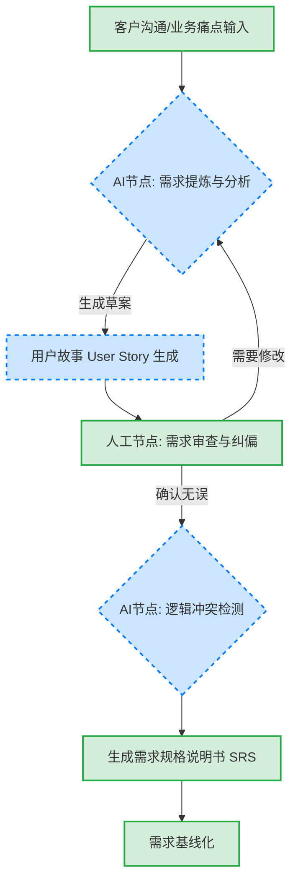
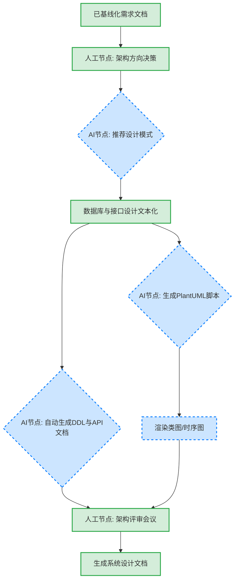
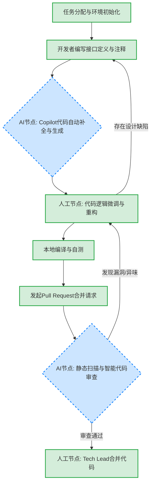
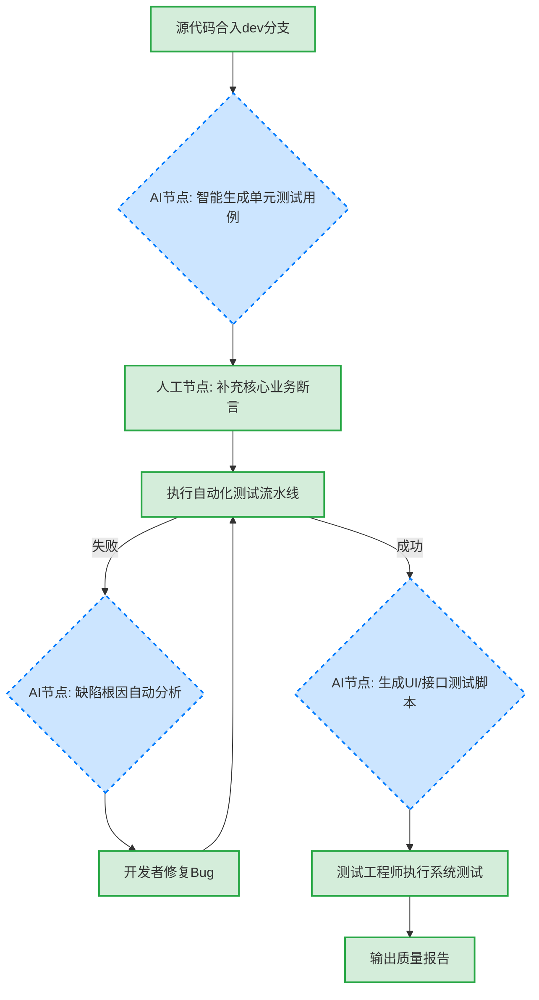
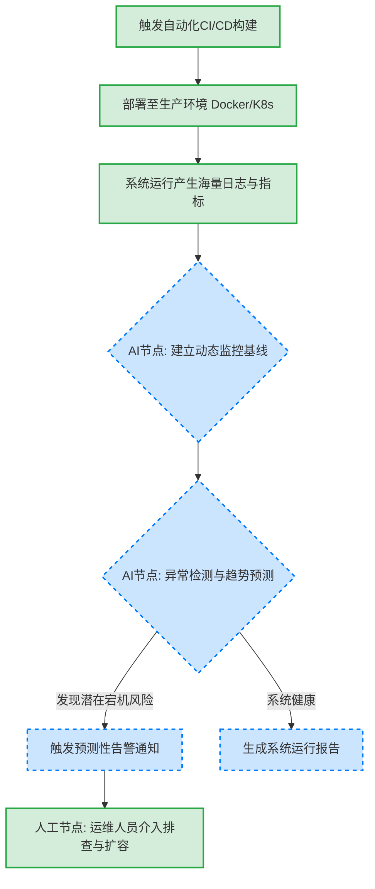

# **完整软件过程定义文档与作业报告**

**姓名**：王涵

**学号**：2023141461082

**课程**：软件过程与管理 (2026年春)

**项目基线**：Vue \+ Spring Boot 前后端分离Web项目

**过程标准基线**：ISO/IEC 12207 / 敏捷迭代开发

# **🔴 上篇：软件过程智能化改进作业报告**

## **1\. 调研分析结果**

### **1.1 行业技术趋势研究 (2024-2026)**

随着大型语言模型（LLM）和智能体（Agent）技术的飞速发展，软件工程（Software Engineering）正经历从“流程驱动”向“人机协同（Human-AI Pairing）的智能范式”转型，即AI4SE（AI for Software Engineering）。基于对近年来行业报告和文献的调研，AI在软件生命周期各阶段的应用成果如下：

* **需求分析阶段**：AI已从简单的文本润色进化为具备领域知识的“业务分析师”。工具如Claude 3.5和GPT-4o能够通过自然语言对话捕获需求，自动生成符合INVEST原则的用户故事，并构建需求追踪矩阵，进行需求一致性验证。  
* **系统设计阶段**：AI驱动的架构设计工具不仅能推荐微服务或领域驱动设计（DDD）模式，还能直接通过文本描述自动生成UML类图、时序图（如集成PlantUML）以及数据库的DDL脚本。  
* **编码实现阶段**：AI编码助手（如GitHub Copilot、Cursor）已经成为行业标配，实现了从单行代码补全向跨文件、上下文感知生成的进化。此外，自动化的智能代码审查（AI Code Review）能够在代码合并前检测出潜在的安全漏洞与代码异味。  
* **测试验证阶段**：基于大模型的测试工具（如Testin XAgent、WHartTest）彻底改变了测试范式。AI不仅能分析源码自动生成高覆盖率的单元测试用例，还能实现UI自动化测试脚本的“智能自愈”，以及预测系统可能出现缺陷的高危模块。  
* **运维监控阶段**：AIOps（智能运维）通过机器学习算法对海量日志和监控指标进行异常检测，实现从“事后报警”到“预测性告警”的跨越，并能基于因果知识图谱进行根因自动分析（RCA）。

### **1.2 现有过程痛点与场景匹配分析**

在本人前期《软件过程剪裁与定义（Assgt\_01）》作业中，针对中小型Web项目（Vue+Spring Boot+MySQL）裁剪出了一套敏捷软件过程。但在实际执行中，仍暴露出以下效率瓶颈：

1. **需求文档编写繁琐**：将客户口语化的需求转化为结构化的软件需求规格说明书（SRS）耗时过长，且容易遗漏异常边界。  
2. **样板代码重复劳动**：Spring Boot的Controller/Service/Mapper三层架构以及Vue的前端表单页面存在大量同质化代码。  
3. **单元测试覆盖率低**：受限于项目工期，开发者往往忽略编写耗时的Mock测试用例，导致代码质量难以保证。

**场景匹配结论**：针对上述痛点，决定在**需求提炼、代码生成、单元测试生成、智能代码审查**四个关键环节引入AI技术，这四个场景投入产出比最高，能最显著地提升本项目的研发效能。

## **2\. 改进方案设计思路**

### **2.1 过程重构策略：“人机结对”范式**

改进方案的核心不只是引入新工具，而是重构工作流。我们将AI定位为“虚拟团队成员”，确立“AI赋能，人类决策”的核心价值观：

* **发散与生成交由AI**：例如生成需求草案、编写样板代码、枚举测试用例边界。  
* **逻辑与决策保留在人工**：例如架构模式拍板、核心算法优化、业务需求最终确认。

### **2.2 工具链选型与集成**

* **需求阶段**：选用 **Claude 3.5 Sonnet**。将其作为SaaS工具，结合预设的Prompt模板，辅助生成结构化文档。  
* **编码与审查阶段**：选用 **GitHub Copilot / Cursor**。深度集成于开发者的IDE（IntelliJ IDEA, WebStorm）中，提供无缝的代码补全和重构建议。同时在GitLab CI/CD中集成 **CodiumAI** 插件，实现自动化提交前审查。  
* **测试阶段**：选用 **ChatGPT-4o / WHartTest**。结合IDE插件直接读取上下文并生成JUnit 5 \+ Mockito测试用例。

### **2.3 风险评估与应对策略**

* **数据安全与隐私风险**：直接将核心代码或真实用户数据发送给公有云模型可能导致数据泄露。**应对策略**：代码生成仅使用企业版（不用于二次训练）或私有化部署模型；严禁在Prompt中输入真实Token或生产环境数据库结构，必须进行数据脱敏。  
* **模型幻觉与质量失控**：AI可能“一本正经地胡说八道”，调用不存在的API。**应对策略**：建立“人工控制门”，强制要求所有AI生成的代码必须经过开发者人工Review，且必须通过自动化编译和测试流水线拦截。  
* **技术依赖退化**：长期依赖AI可能导致初级开发人员系统设计能力下降。**应对策略**：定期组织断网状态下的“纯手工Coding”培训，强调开发者必须“知其然且知其所以然”。

## **3\. 原型验证过程与结论**

### **3.1 验证场景设计**

选取“编码实现与测试验证”阶段的核心任务进行最小可行性验证（MVP）：编写Spring Boot后端 RolePermissionService（角色权限与动态菜单树生成）的业务逻辑，并生成单元测试。

### **3.2 执行过程与结果对比**

* **AI代码生成**：开发者在IDE中编写自然语言注释 // 根据角色ID列表查询启用菜单，构建树形结构按sortOrder排序并缓存至Redis(1小时)。GitHub Copilot瞬间生成了包含Stream API递归逻辑和RedisTemplate调用的完整代码。人工仅耗时2分钟调整了Redis Key的前缀规范。  
* **AI单测生成**：将生成的代码喂给GPT-4o，要求“使用JUnit5和Mockito生成单元测试，覆盖正常树形、无角色、数据库为空、缓存命中4个场景”。AI在10秒内生成了150+行代码，IDE中直接运行，4个用例全部通过，分支覆盖率达88%。

**数据对比结论**：

* **开发耗时**：传统人工约需120分钟（查阅递归与API用法），AI辅助下仅需15分钟，**耗时缩短87.5%**。  
* **单测耗时**：传统人工搭建Mock环境及编写边界用例约需90分钟，AI辅助下仅需10分钟，**耗时缩短88.9%**。  
* **质量提升**：AI补充了人类极易遗漏的缓存未命中测试分支，有效降低了代码缺陷密度。

## **4\. 成果总结与未来展望**

本次作业不仅在理论上重构了软件过程，更通过真实工具验证了AI4SE的巨大潜力。AI的引入将软件工程从“体力劳动”解放出来，使开发者能够更加专注于业务理解与系统架构创新。

**未来展望**：随着多智能体（Multi-Agent）技术的成熟，未来的软件过程将向“自治软件工程”演进，项目经理的职责可能转变为“编排智能体工作流（Agentic Workflow）”，实现需求到部署的端到端自动化。

# **🔵 下篇：改进后的完整软件过程定义文档 (V2.0 AI增强版)**

## **一、 过程概述与目标**

本文档基于前期提交的《软件过程剪裁与定义（Assgt\_01）》成果进行迭代升级。原过程以 **ISO/IEC 12207** 为基础，针对5-10人团队的Vue+Spring Boot敏捷Web项目进行了裁剪。

本次升级旨在将大型语言模型（LLM）、智能代码助手和智能测试工具深度融入软件生命周期的全阶段，建立一套适应新时代的“人机协同智能软件过程体系”。

* **目标**：提升研发效率30%以上，降低低级代码缺陷率，实现单测覆盖率达到80%的质量标准，最终缩短产品Time-to-Market（上市时间）。

## **二、 角色职责定义（新增AI相关角色）**

在传统敏捷团队架构基础上，重新定义并扩展了适应智能化研发的角色：

| 角色名称 | 传统职责 | 智能化重构后新增/演进职责 |
| :---- | :---- | :---- |
| **产品经理 (PM)** | 竞品分析、业务调研、手写PRD文档 | 熟练使用LLM辅助进行头脑风暴；通过AI快速提炼原始需求，一键生成标准User Story。 |
| **架构师 (Architect)** | 技术选型、核心系统架构设计 | 使用AI辅助评估架构方案；利用LLM自动将设计思路转化为UML图表代码；审查AI代码的安全合规性。 |
| **开发工程师 (Dev)** | 编写前端Vue组件、后端业务逻辑 | 掌握**AI提示词工程(Prompt Engineering)**；使用Copilot生成样板代码与基础业务逻辑；将主要精力放在AI代码的审查、重构与复杂算法优化上。 |
| **智能测试分析师 (AI Test Analyst)** | *(原QA测试)*：手写测试脚本、点点点执行手工测试 | 升级为智能分析师：管理AI测试自动化框架；设计高价值的Prompt引导AI生成复杂场景用例；分析AI抓取出的深层缺陷根因。 |
| **🆕 AI研发协同师 (AI Coordinator)** | **(本次过程新增核心角色，通常由资深技术骨干兼任)** | 负责挑选、采购和配置团队的AI工具链；**编写并维护团队级的公共Prompt模板库（知识库）**；对团队成员进行AI工具赋能与最佳实践培训；监控工具的安全合规风险。 |

## **三、 各阶段活动流程图与详细说明（含AI参与节点）**

本过程将软件生命周期裁剪为五大核心阶段，并在每个阶段设立明确的“AI参与节点（AI Node）”与“人工控制门（Human Gate）”。

### **3.1 需求工程阶段 (Requirements Engineering)**

**目标**：快速且准确地将业务语言转化为无歧义、可追溯的软件规格说明。

* **执行说明**：  
  1. 产品经理将会议纪要、语音转写等非结构化文本输入大模型。  
  2. **[AI参与]**：AI根据上下文，自动提取核心业务实体，并按给定模板生成需求点。  
  3. **[AI参与]**：AI自动将需求转换为格式化的“User Story”和验收标准（Acceptance Criteria）。  
  4. **[人工控制门]**：产品经理必须对生成的文档进行业务逻辑复核，避免AI幻觉。

### **3.2 系统设计阶段 (System Design)**

**目标**：设计稳定可扩展的微服务或单体架构及数据结构。

* **执行说明**：  
  1. 架构师主导核心技术栈（Vue3 \+ Spring Boot 3 \+ MySQL）的拍板。  
  2. **[AI参与]**：架构师将业务流程用自然语言描述，AI工具（集成PlantUML）直接生成出架构图、序列图代码并渲染。  
  3. **[AI参与]**：输入实体属性要求，AI自动输出符合规范的MySQL建表语句（含索引和注释）及Swagger接口定义草案。

### **3.3 编码实现阶段 (Implementation) \- 【核心智能化重构区】**

**目标**：人机协同，高效、高质量地将设计转化为可执行代码。

* **执行说明**：  
  1. **[AI主导，人工把关]**：开发者通过书写清晰的业务注释（Prompt），引导IDE中的GitHub Copilot/Cursor生成Controller接口、MyBatis-Plus的Mapper映射以及Vue的表单绑定逻辑。  
  2. **[人工控制门]**：**绝对禁止**开发者盲目接受未阅读的代码。开发者必须对AI代码进行逐行审查，优化复杂嵌套，确保符合《Java开发规范》。  
  3. **[AI参与]**：在提交合并时，触发CI流水线上的AI Review机器人，自动拦截空指针风险、SQL注入风险以及硬编码问题。

### **3.4 测试验证阶段 (Testing)**

**目标**：彻底告别无单测时代，利用AI生成高覆盖率测试网，保障交付质量。

* **执行说明**：  
  1. **[AI参与]**：对于Service层核心代码，使用大模型工具自动生成基于 JUnit 5 和 Mockito 的单元测试代码，特别是自动生成繁琐的Mock数据和边界值测试。  
  2. 测试分析师人工校验AI生成的断言是否具备真实的业务拦截意义。  
  3. **[AI参与]**：利用接口自动化生成工具读取Swagger文档，自动生成Postman/JMeter接口测试集合。当测试不通过时，AI辅助分析Error Log，快速定位异常抛出源头。

### **3.5 部署与运维监控阶段 (Deployment & Operations)**

**目标**：平滑发布应用，实现从“事后报警”向“预测性告警”的智能运维转变。

* **执行说明**：  
  1. 通过Jenkins或GitLab CI自动化完成代码打包、Docker镜像构建和服务器部署。  
  2. **[AI参与]**：传统的静态阈值报警（如CPU\>80%报警）容易产生噪音。引入AIOps机制，AI通过学习系统一周的运行基线，对异常流量突增或内存缓慢泄漏进行预测性预警，辅助运维人员在系统崩溃前进行人工干预。

## **四、 交付物清单与AI质量准入标准**

在智能化过程下，交付物的验收必须加入针对AI特性的防范标准，防止“垃圾进，垃圾出”。

| 所属阶段 | 交付物名称 | AI增强后的交付格式要求 | 质量标准及AI特有验证机制 |
| :--- | :--- | :--- | :--- |
| **需求阶段** | 《需求规格说明书 (SRS)》 | Markdown文档 / 敏捷看板条目 | 1. 业务逻辑构成闭环。 2. **人工声明门槛**：产品经理签字确认已全文复核，不存在大模型幻觉编造的非客户需求。 3. 用户故事具备清晰的验收标准。 |
| **设计阶段** | 《系统设计文档》、DDL、接口定义 | 包含Markdown文本及嵌入的UML代码、Swagger在线文档 | 1. 架构符合团队当前的技术基线。 2. 数据库设计符合第三范式及索引规范。 3. 接口字段命名符合驼峰规范，无僵硬的机器翻译痕迹。 |
| **编码阶段** | 源代码及相关配置文件 | Git仓库版本控制记录 | 1. 必须通过AI辅助的静态安全扫描。 2. **严禁**代码中残留AI生成的占位符（如 `// TODO: implement here`）。 3开发者必须能够向架构师解释每一行AI生成代码的底层逻辑。 |
| **测试阶段** | 自动化测试脚本、测试报告 | 单元测试代码仓库、CI流水线测试通过报告 | 1. 核心业务代码分支覆盖率（Branch Coverage）≥80%。 2. 测试断言必须严谨，不得出现为应付覆盖率而产生的“空断言”或无意义断言。 |

## **五、 过程度量体系 (含AI贡献度指标)**

为了科学评估本次“智能化过程重构”的实际效果，我们在保留传统软件度量指标的同时，新增了专门针对**AI贡献度**和人机协同效能的过程度量指标：

### **5.1 传统研发度量指标（基准）**

* **按时交付率 (On-Time Delivery Rate)**：迭代周期内按时完成的故事点占比。（预期提升）  
* **千行代码缺陷率 (Defect Density)**：每千行代码中在测试阶段及上线后发现的Bug数量。（预期下降）

### **5.2 AI贡献度核心指标（新增）**

**1\. AI代码采纳率 (AI Code Acceptance Rate)**

* **定义与公式**：开发者在IDE中保留并提交的AI生成代码行数 / AI总计建议提供的代码行数 x100%。  
* **度量目的**：反映团队使用的AI大模型在当前业务领域的智能匹配水平，以及开发者自身书写Prompt的能力。  
* **质量目标**：期望目标值 ≥40%。若低于此值，说明AI生成的代码多为废代码，需优化Prompt库或更换工具。

**2\. AI辅助提效比 (Time Saved Percentage)**

* **定义与公式**：(同类历史项目功能单人日产出量 \- 当前AI辅助单人日产出量) / 同类历史项目单人日产出量 x100%。  
* **度量目的**：直观反映AI引入带来的直接生产力释放和时间成本节约。  
* **质量目标**：期望在编码阶段提效比达到 30%~50%。

**3\. 缺陷拦截前移度 (Defect Shift-Left Index)**

* **定义与公式**：在代码提交前的本地环境（单测生成+AI审查拦截）发现并修复的缺陷数 / 整个生命周期缺陷总数 x100%。  
* **度量目的**：验证AI是否有效帮助团队践行了“测试左移”理念，尽早发现了问题，降低了修复成本。  
* **质量目标**：期望目标值 ≥60%（意味着大部分问题在QA测试前已被AI防线解决）。

**4\. 自动化测试用例生成占比 (AI-Generated Test Ratio)**

* **定义与公式**：项目中由AI工具生成的自动化测试用例总数 / 项目自动化测试用例总数 x100%。  
* **度量目的**：衡量AI在替代测试人员编写繁琐脚本方面的贡献。  
* **质量目标**：期望达到 70% 以上。

### **附录：参考文献**

1. 中国信通院. 《智能化软件工程技术和应用要求 第3部分:智能测试能力》, 2024\.  
2. Gtest全球软件测试技术峰会. 《2025软件测试前沿趋势资料汇编》, 2025\.  
3. 艾瑞咨询 / InfoQ. 《AI4SE 行业现状与开发者调研调查报告》, 2024\.  
4. 王自强. 《AI原生自动化测试范式及落地路径研究》, 软件工程学报, 2025\.  
5. 李争. 《基于大型语言模型的生成式AI在需求工程中的应用与挑战》, 计算机科学与探索, 2024\.  
6. GitHub. *GitHub Copilot Enterprise Documentation & Best Practices*, 2025/2026.  
7. ISO/IEC/IEEE. *ISO/IEC/IEEE 12207:2017 Systems and software engineering — Software life cycle processes*.

*(文档结束)*