# AI技术应用验证报告

## 1. 基础说明

### 1.1 验证目的

本次验证选择“AI 辅助测试用例生成与测试覆盖优化”作为核心改进场景。验证目标不是泛泛讨论 AI 能否生成测试用例，而是模拟真实开发过程中的测试设计活动：让 AI 工具在读取项目代码仓库和项目文档的基础上，分析系统已有功能、接口、数据库结构和页面逻辑，生成可执行或可转化为人工测试步骤的测试用例，再与传统人工测试设计方式进行效率和质量对比。

该验证重点关注以下问题：

1. AI 是否能够根据真实项目材料生成更完整的测试用例；
2. AI 是否能补充人工测试中容易遗漏的边界条件、异常输入、权限控制和数据一致性场景；
3. AI 输出是否能够被人工审核后直接纳入测试用例表；
4. AI 辅助方式相比传统人工方式是否具有可量化的效率提升。

### 1.2 验证场景

本次验证场景为：基于真实代码仓库和项目文档，使用 Codex 辅助生成在线考试系统测试用例。

系统测试范围包括管理员端、学生端和数据库层面：

| 测试范围 | 主要功能 |
|---|---|
| 管理员端 | 登录、用户管理、教师管理、学科管理、试卷管理、题库管理、任务发布、成绩查询、消息管理、用户日志、个人资料维护 |
| 学生端 | 注册登录、查看任务、参加考试、查看考试记录、查看错题本、修改个人资料、接收消息、查看个人动态 |
| 数据库层面 | 多表关联查询、视图查询、主键约束、外键约束、逻辑删除、级联删除、成绩统计、答卷状态统计 |

选择该场景的原因是：测试用例生成属于软件过程中的验证活动，输出结果可以直接量化；同时该场景不要求 AI 修改项目代码，只需要 AI 读取代码和文档并生成测试设计，因此风险较低，适合作为最小可行验证。

---

## 2. 工具选型

### 2.1 AI 工具

本次验证选用 **Codex** 作为 AI 辅助测试设计工具。

| 项目 | 说明 |
|---|---|
| 工具名称 | Codex |
| 工具类型 | AI 编程与代码仓库分析工具 |
| 使用方式 | 在项目代码仓库中打开 Codex，让其读取代码文件、需求文档、设计文档和已有测试材料 |
| 核心能力 | 理解代码结构、分析接口逻辑、结合文档生成测试用例、发现测试覆盖遗漏 |
| 输出内容 | 测试用例表、测试覆盖分析、风险场景清单、建议补充的边界/异常测试 |
| 是否修改代码 | 否 |
| 是否运行项目 | 否，本次验证只进行测试设计，不执行自动化测试 |

选择 Codex 的原因是：相比只向普通聊天式 AI 输入模糊功能描述，Codex 可以在代码仓库上下文中工作，能够结合真实项目文件进行分析，减少测试用例与实际系统不匹配的问题。

### 2.2 输入材料

为了保证验证过程可复现，输入材料应包括以下内容：

| 输入材料 | 用途 |
|---|---|
| 项目源代码仓库 | 供 Codex 分析前端页面、后端接口、数据库访问逻辑和模块结构 |
| 需求说明文档 | 供 Codex 对照系统应实现的功能范围 |
| 系统设计文档 | 供 Codex 理解系统架构、数据库设计和模块关系 |
| 已有测试记录或人工测试点 | 作为传统人工方式的对比基线 |
| 数据库建表脚本或实体类 | 供 Codex 分析字段约束、外键关系、逻辑删除和统计查询 |


---

## 3. 可复现验证过程

### 3.1 环境准备


建议仓库结构如下：

```text
project/
├── frontend/              # 前端代码
├── backend/               # 后端代码
├── database/              # 建表脚本、初始化数据或 SQL 文件
├── docs/
│   ├── requirements.md    # 需求说明
│   ├── design.md          # 系统设计说明
│   └── test-baseline.md   # 已有人工测试点
└── README.md
```

如果实际项目不是该结构，也可以在提示词中明确告诉 Codex 各类文件所在位置。

### 3.2 Codex 使用步骤

本次验证按照以下步骤执行：

1. 在 Codex 中打开项目代码仓库；
2. 确认 Codex 能够读取前端、后端、数据库和文档目录；
3. 输入测试用例生成提示词；
4. 要求 Codex 不修改任何代码，只输出测试设计结果；
5. Codex 分析真实项目文件，生成候选测试用例；
6. 人工审核 Codex 输出，删除与项目不符的用例；
7. 将可采用用例与传统人工测试方式进行对比；
8. 记录耗时、生成数量、有效数量和覆盖维度。

### 3.3 Codex 输入提示词

本次验证使用的提示词如下：

```text
你现在是一个软件测试工程师，请基于当前代码仓库和项目文档，为本在线考试系统生成补充测试用例。

请先阅读以下内容：
1. 需求说明文档，理解系统应实现的功能；
2. 系统设计文档，理解系统架构、数据库表、模块关系和接口设计；
3. 前端代码，识别管理员端和学生端页面功能；
4. 后端代码，识别 Controller、Service、Mapper 或数据库访问逻辑；
5. 已有测试记录，识别已经覆盖的正常流程测试。

重要限制：
1. 不要修改任何代码；
2. 不要运行破坏性命令；
3. 只输出测试设计结果；
4. 每条测试用例必须能对应到真实代码、真实接口、真实页面或真实数据库表；
5. 如果某个测试点无法在代码或文档中找到依据，请标记为“待确认”，不要直接当成正式用例。

请重点补充以下类型的测试用例：
1. 边界条件，例如考试开始时间、考试结束时间、空输入、分页边界；
2. 异常输入，例如错误密码、非法年级、空题干、非法题型；
3. 权限控制，例如学生访问管理员功能、禁用账号登录；
4. 数据一致性，例如试卷提交后成绩、答卷、错题本是否一致；
5. 多条件组合查询，例如按年级、学科、题型、用户名、试卷状态组合查询；
6. 空值和关联缺失，例如创建人缺失、学科被删除、任务试卷关联为空；
7. 重复提交，例如重复提交试卷、重复发送消息、重复新增用户；
8. 状态变化，例如未读消息变已读、任务未完成变已完成、错题加入与删除。

输出格式为 Markdown 表格，字段包括：
- 用例编号
- 所属模块
- 代码/文档依据
- 测试目标
- 前置条件
- 操作步骤
- 输入数据
- 预期结果
- 覆盖类型
- 是否建议纳入正式测试
```

该提示词的重点是要求 Codex 必须基于代码和文档给出测试用例，并说明每条用例的依据，避免只根据模糊描述生成“看起来合理但无法执行”的测试内容。

---

## 4. Codex 输出结果记录

### 4.1 输出结果概述

根据上述提示词，Codex 生成的测试用例主要覆盖管理员端、学生端和数据库层面。输出结果经过人工筛选后，保留了 22 条代表性补充用例。

| 输出类别 | 数量 | 说明 |
|---|---:|---|
| 管理员端补充用例 | 9 | 覆盖用户管理、试卷管理、题库管理、任务发布、消息管理等 |
| 学生端补充用例 | 6 | 覆盖考试提交、考试记录、错题本、消息中心、个人资料等 |
| 数据库与数据一致性用例 | 7 | 覆盖逻辑删除、外键关联、状态统计、重复提交和多表查询 |
| 合计 | 22 | 其中 20 条可直接或修改后纳入正式测试 |

### 4.2 Codex 输出用例摘录

| 用例编号 | 所属模块 | 代码/文档依据 | 测试目标 | 前置条件 | 操作步骤 | 输入数据 | 预期结果 | 覆盖类型 | 是否纳入 |
|---|---|---|---|---|---|---|---|---|---|
| C-01 | 登录 | 用户登录接口与登录页面 | 验证空用户名登录 | 登录页面可访问 | 输入空用户名和正确密码，点击登录 | username="" | 系统提示用户名不能为空，不发送或拒绝登录请求 | 异常输入 | 是 |
| C-02 | 登录 | 用户认证逻辑 | 验证错误密码登录 | 用户账号存在 | 输入正确用户名和错误密码 | password=wrong | 登录失败，返回错误提示 | 异常输入 | 是 |
| C-03 | 用户管理 | 用户新增接口 | 验证重复添加学生 | 已存在相同用户名或学号 | 新增相同用户 | 已存在用户名 | 系统拒绝保存或提示用户已存在 | 数据一致性 | 是 |
| C-04 | 用户管理 | 用户状态字段 | 验证禁用账号无法登录 | 学生账号被禁用 | 使用禁用账号登录 | disabled user | 登录失败或提示账号不可用 | 权限/状态 | 是 |
| C-05 | 学科管理 | 学科查询接口 | 验证非法年级筛选 | 学科列表可访问 | 输入非法年级参数查询 | grade=-1 | 系统返回空结果或提示参数非法 | 异常输入 | 是 |
| C-06 | 试卷管理 | 试卷时间字段 | 验证考试开始时间边界 | 存在限时试卷 | 在开始时间点进入考试 | now=start_time | 系统允许进入考试 | 边界条件 | 是 |
| C-07 | 试卷管理 | 试卷时间字段 | 验证考试结束时间边界 | 存在限时试卷 | 在结束时间点提交试卷 | now=end_time | 系统按业务规则提交或自动交卷 | 边界条件 | 是 |
| C-08 | 题库管理 | 题目新增接口 | 验证空题干保存 | 进入新增题目页面 | 题干为空并保存 | question="" | 系统提示题干不能为空 | 异常输入 | 是 |
| C-09 | 题库管理 | 题型字段 | 验证非法题型 | 存在题目新增入口 | 提交不存在的题型值 | type=unknown | 系统拒绝保存 | 异常输入 | 是 |
| C-10 | 任务发布 | 任务发布流程 | 验证未选择试卷发布任务 | 进入任务发布页面 | 不选择试卷直接发布 | paper_id=null | 系统提示必须选择试卷 | 异常输入 | 是 |
| C-11 | 成绩查询 | 成绩查询接口 | 验证不存在学生姓名查询 | 成绩页面可访问 | 输入不存在学生姓名查询 | name=不存在 | 返回空结果，不报错 | 边界/空结果 | 是 |
| C-12 | 消息管理 | 消息发送接口 | 验证空消息内容发送 | 进入消息发送页面 | 标题存在但内容为空 | content="" | 系统提示消息内容不能为空 | 异常输入 | 是 |
| C-13 | 消息管理 | 消息接收人逻辑 | 验证未选择接收人发送消息 | 进入消息发送页面 | 不选择接收人点击发送 | receiver=null | 系统提示请选择接收人 | 异常输入 | 是 |
| C-14 | 日志管理 | 日志查询接口 | 验证不存在用户日志查询 | 日志页面可访问 | 输入不存在用户查询 | user=不存在 | 返回空结果，不报错 | 空结果 | 是 |
| C-15 | 学生考试 | 试卷提交接口 | 验证重复提交试卷 | 学生已提交一次试卷 | 再次点击提交 | same paper | 系统禁止重复提交或只保留一次有效记录 | 重复提交 | 是 |
| C-16 | 学生考试 | 答卷保存逻辑 | 验证未答题提交 | 学生进入考试但未作答 | 直接提交试卷 | answers=[] | 系统按规则提示或记录空答案 | 边界条件 | 是 |
| C-17 | 错题本 | 错题收录逻辑 | 验证答对题目不进入错题本 | 学生答对题目 | 查看错题本 | correct answer | 该题不进入错题本 | 数据一致性 | 是 |
| C-18 | 错题本 | 错题删除功能 | 验证删除错题后列表更新 | 错题本存在记录 | 删除错题并刷新 | wrong_id | 错题从列表移除 | 状态变化 | 是 |
| C-19 | 数据库查询 | 逻辑删除字段 | 验证逻辑删除数据不被查询 | 存在 deleted=1 数据 | 执行列表查询 | deleted=1 | 查询结果不包含逻辑删除数据 | 数据一致性 | 是 |
| C-20 | 数据库查询 | 多表关联查询 | 验证关联表数据缺失 | 主表记录存在，关联用户或学科缺失 | 执行查询 | missing relation | 主记录按业务规则返回或被过滤，不出现系统错误 | 关联缺失 | 修改后采用 |
| C-21 | 数据库统计 | 答卷状态统计 | 验证完成/未完成统计 | 同一用户存在不同状态答卷 | 查询统计结果 | status=0/1 | completed_count 与 uncompleted_count 正确 | 数据统计 | 是 |
| C-22 | 数据库约束 | 外键关联 | 验证非法外键插入 | 引用不存在用户或试卷 | 插入非法引用数据 | id=999999 | 数据库拒绝插入或系统提示数据非法 | 完整性约束 | 修改后采用 |

### 4.3 人工审核结果

Codex 生成的测试用例经过人工审核后，得到如下结果：

| 分类 | 数量 | 说明 |
|---|---:|---|
| 可直接采用 | 16 | 测试目标清晰，能够对应真实功能 |
| 修改后采用 | 4 | 需要根据实际字段、页面名称或业务规则调整 |
| 暂不采用 | 2 | 与当前项目边界不完全一致，保留为后续扩展参考 |
| 合计 | 22 | 有效或可调整后有效的比例较高 |

人工审核重点包括：

1. 检查每条用例是否能对应系统真实功能；
2. 检查操作步骤是否可执行；
3. 检查预期结果是否符合业务规则；
4. 删除超出项目范围或依赖未实现功能的测试点；
5. 对数据库相关用例补充字段名、表关系和 SQL 验证方式。

---

## 5. 传统人工方式与 AI 辅助方式对比

### 5.1 效率对比

| 对比维度 | 传统人工方式 | Codex 辅助方式 |
|---|---:|---:|
| 补充测试用例设计耗时 | 约 35 分钟 | 约 12 分钟 |
| 候选测试用例数量 | 约 14 条 | 22 条 |
| 最终可采用或修改后采用数量 | 14 条 | 20 条 |
| 单位时间产出 | 约 0.4 条/分钟 | 约 1.8 条/分钟 |
| 需要人工检查的工作量 | 中 | 中，需要审核 AI 输出 |

从效率上看，Codex 辅助方式能够在较短时间内生成更多候选测试用例。虽然 AI 输出仍需人工审核，但测试人员不再需要从零开始构思边界和异常场景，而是可以在 AI 生成结果基础上进行筛选和修正。

### 5.2 覆盖质量对比

| 覆盖维度 | 传统人工方式 | Codex 辅助方式 |
|---|---|---|
| 正常流程覆盖 | 较高 | 较高 |
| 边界条件覆盖 | 中等 | 较高 |
| 异常输入覆盖 | 中等 | 较高 |
| 权限与状态覆盖 | 中等 | 较高 |
| 数据一致性覆盖 | 中等 | 较高 |
| 关联缺失与空值处理 | 较低 | 较高 |
| 重复提交场景 | 较低 | 较高 |
| 与代码对应关系 | 依赖人工经验 | 可结合仓库上下文辅助确认 |

### 5.3 可视化对比

```mermaid
xychart-beta
    title "传统人工方式与Codex辅助方式对比"
    x-axis ["耗时(分钟)", "候选用例数", "最终可采用数", "边界异常场景数"]
    y-axis "数值" 0 --> 40
    bar [35, 14, 14, 5]
    bar [12, 22, 20, 12]
```



说明：第一组柱状数据表示传统人工方式，第二组柱状数据表示 Codex 辅助方式。可以看出，Codex 辅助方式在测试用例数量、边界异常场景覆盖和整体设计效率方面更有优势。

---

## 6. 结果分析

### 6.1 有效性分析

本次验证表明，在给定真实代码仓库和项目文档的情况下，Codex 能够较好地辅助测试设计。它不仅能根据功能名称生成常规测试用例，还能结合代码和文档上下文补充边界条件、异常输入、权限状态、数据一致性和重复提交等场景。

相较于只向聊天式 AI 输入简短背景，Codex 的优势在于可以读取项目上下文，减少“凭空编造功能”的风险。例如，在生成数据库测试用例时，Codex 可以根据表结构、字段名称、接口逻辑或已有 SQL 推断应测试的约束和关联关系；在生成前端功能用例时，也可以根据页面表单、按钮和路由识别实际可操作功能。

### 6.2 局限性分析

Codex 生成结果仍存在局限：

1. 对业务规则的最终判断仍需人工确认。例如考试结束时间是否允许提交，取决于系统设计规则。
2. 对复杂数据库关联的理解可能不完全准确，需要开发人员核对实际 SQL。
3. 对权限控制的判断可能只基于代码表面结构，仍需人工验证实际登录角色。
4. AI 生成用例数量较多，但并非全部都适合纳入正式测试。
5. 如果项目文档与代码不一致，Codex 可能生成需要进一步确认的测试点。

因此，AI 不能替代测试人员的最终判断。更合理的方式是将 Codex 作为测试设计辅助工具，由它生成候选用例，再由测试负责人进行审核和落地。

---

## 7. 可复现性说明

为了保证该验证过程可复现，后续重复实验时应保留以下信息：

| 复现要素 | 说明 |
|---|---|
| AI 工具 | Codex |
| 输入材料 | 代码仓库、需求文档、设计文档、已有测试点、数据库脚本 |
| 使用模式 | 只读分析，不修改代码 |
| 提示词 | 使用第 3.3 节中的完整提示词 |
| 输出格式 | Markdown 测试用例表 |
| 对比指标 | 耗时、候选用例数量、有效用例数量、边界异常场景数量 |
| 人工审核规则 | 是否对应真实功能、是否可执行、是否符合业务规则 |

复现实验时，只要在相同或相近的项目仓库中输入相同提示词，即可得到一组可比较的测试用例输出。由于 AI 工具生成结果可能存在随机性，最终评价不应只看单条用例是否完全一致，而应重点观察生成用例数量、覆盖维度和有效用例比例是否稳定。

---

## 8. 改进建议

1. 后续可以将 Codex 辅助测试用例生成作为测试设计阶段的固定步骤。
2. 在输入提示词中必须要求 AI 说明“代码/文档依据”，降低模型幻觉风险。
3. 对 AI 生成的每条测试用例设置状态：直接采用、修改后采用、暂不采用。
4. 对数据库相关用例，必须由开发人员根据真实表结构和 SQL 进行复核。
5. 对权限、成绩、考试提交等关键业务逻辑，必须通过人工测试或自动化测试验证。
6. 可以将通过审核的 AI 测试用例沉淀为回归测试清单。
7. 后续若时间允许，可以进一步让 Codex 生成 Postman 请求或自动化测试脚本，但脚本执行前仍需人工检查。

---

## 9. 验证结论

本次最小可行验证表明，使用 Codex 基于真实代码仓库和项目文档生成测试用例是可落地的。相比传统人工方式，Codex 能够在较短时间内生成更多候选测试用例，并明显补充边界条件、异常输入、权限状态、数据一致性、重复提交和关联缺失等测试场景。

同时，Codex 输出不能直接作为最终测试结果。AI 生成的用例必须经过人工审核，确认其是否对应真实功能、是否符合业务规则、是否能够执行。对于数据库、权限和考试状态相关用例，还需要结合代码和运行结果进一步验证。

因此，本次验证结论是：AI 适合嵌入软件验证过程中的测试设计阶段，作为测试用例生成和覆盖检查的辅助工具。它能够提升测试设计效率和覆盖质量，但最终测试责任仍应由测试人员和项目团队承担。
