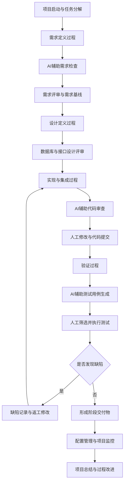
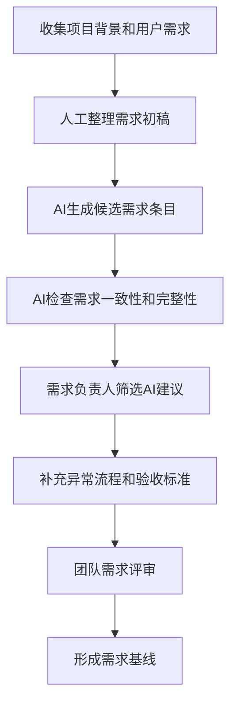
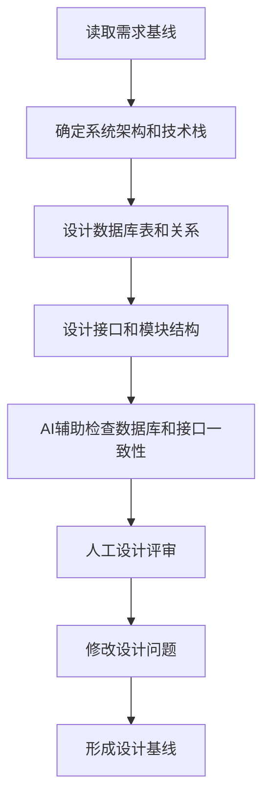
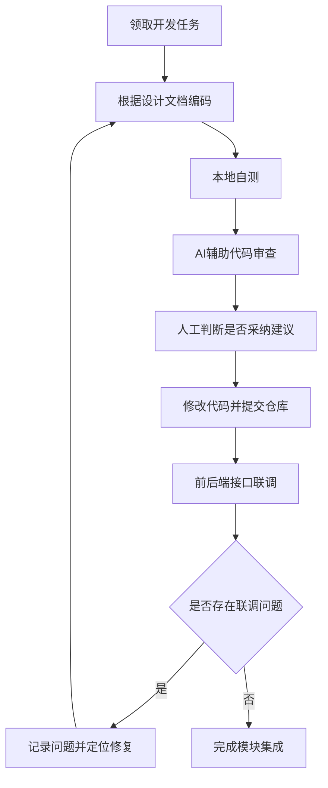
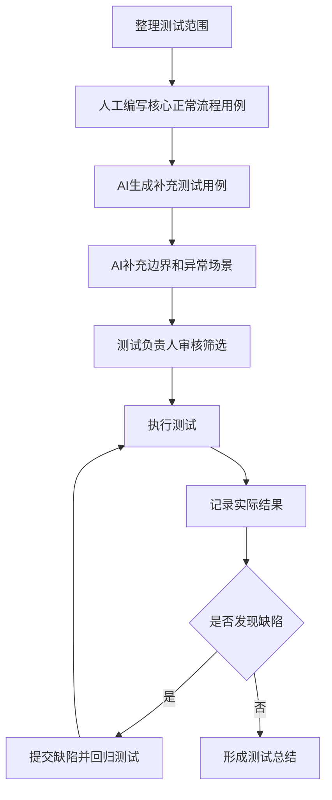
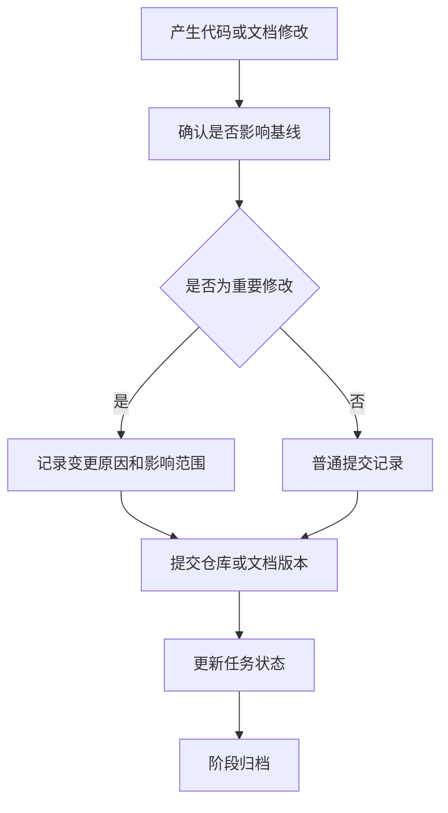
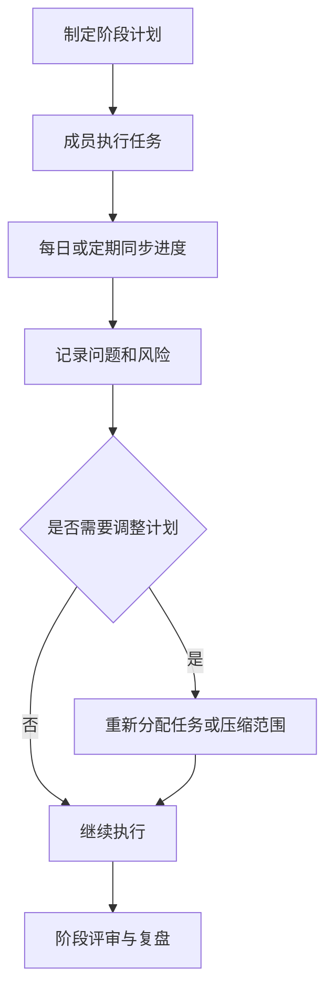
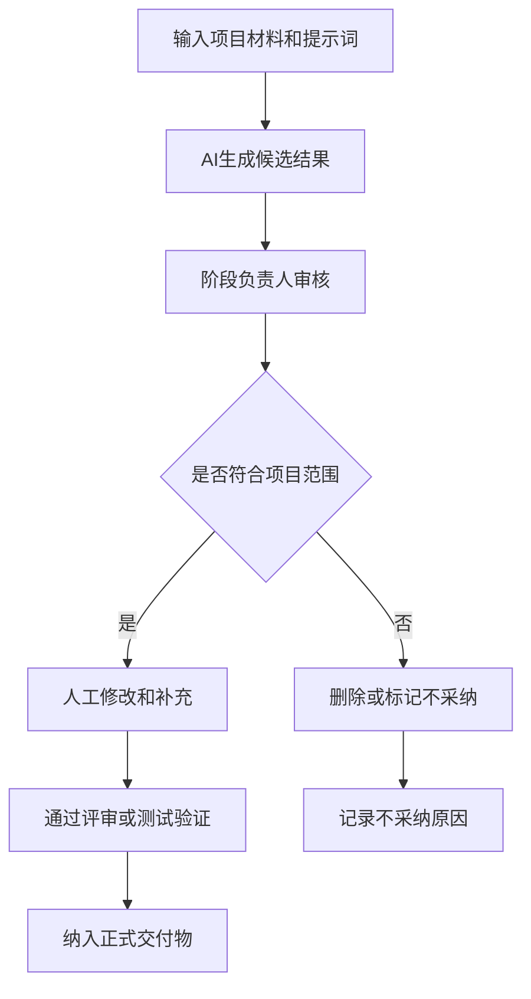

# 改进后的完整软件过程定义文档

> 项目名称：考拉在线考试系统  
> 姓名：杨策华  
> 学号：2023141461207  

---

## 1. 文档概述与目标

本文档是在原有软件过程定义基础上，结合生成式 AI、AI 辅助测试、AI 代码审查等技术，对“考拉在线考试系统”的软件过程进行改进后形成的完整过程定义文档。文档重点说明在需求分析、系统设计、编码实现、测试验证、配置管理和项目监控等环节中，如何引入 AI 工具和人机协同机制，以提升需求完整性、测试覆盖率、缺陷定位效率和团队协作质量。

本过程定义适用于课程项目、小规模团队项目和快速迭代型 Web 系统开发。本文档不将 AI 定义为替代开发人员的工具，而是将其定位为“辅助生成、辅助检查、辅助分析”的协作工具。所有 AI 输出内容均需经过人工审核后才能进入正式交付物、测试用例或代码修改清单。

本过程定义的主要目标包括：

1. 在需求阶段利用 AI 辅助发现需求遗漏、冲突和不可测试表述；
2. 在实现阶段利用 AI 辅助代码审查、接口检查和缺陷定位；
3. 在测试阶段利用 AI 生成测试用例并补充边界、异常和组合场景；
4. 在配置管理和项目监控阶段记录 AI 使用过程，保证过程可追踪；
5. 建立 AI 输出物质量标准、度量指标和风险控制机制。

---

## 2. 软件过程总体模型

### 2.1 生命周期过程划分

结合项目特点，改进后的软件过程划分为以下六类：

| 过程类别 | 过程名称 | 主要目标 |
|---|---|---|
| 主要过程 | 需求定义过程 | 明确系统功能、用户角色、业务规则和验收标准 |
| 主要过程 | 设计定义过程 | 明确系统架构、数据库结构、接口规范和模块划分 |
| 主要过程 | 实现与集成过程 | 完成前后端功能开发、接口联调和代码集成 |
| 主要过程 | 验证过程 | 通过功能测试、数据库测试和 AI 辅助测试提升质量 |
| 支持过程 | 配置管理过程 | 管理代码、文档、测试用例和 AI 输出记录 |
| 管理过程 | 项目监控与控制过程 | 管理任务进度、风险、会议同步和过程度量 |

### 2.2 改进后的总体流程图

---

## 3. 角色职责定义

### 3.1 原有角色

| 角色 | 主要职责 |
|---|---|
| 项目负责人 | 制定项目计划，协调团队进度，组织会议和阶段评审 |
| 需求负责人 | 收集用户需求，编写需求规格说明，维护需求变更记录 |
| 设计负责人 | 负责系统架构、数据库设计、接口设计和模块划分 |
| 前端开发人员 | 实现页面交互、表单校验、前后端接口调用和用户界面 |
| 后端开发人员 | 实现接口、业务逻辑、数据库访问、权限控制和数据处理 |
| 测试负责人 | 编写测试用例，执行功能测试、数据库测试和回归测试 |
| 配置管理员 | 管理代码仓库、文档版本、基线文件和提交记录 |

### 3.2 新增 AI 相关角色

| 角色 | 主要职责 | 可由谁兼任 |
|---|---|---|
| AI 协作负责人 | 选择 AI 工具，制定提示词规范，记录 AI 使用过程和采纳情况 | 项目负责人或配置管理员 |
| AI 需求分析辅助员 | 使用 AI 生成需求条目、异常流程和验收标准，并进行初步筛选 | 需求负责人 |
| AI 测试分析师 | 使用 AI 生成测试用例，补充边界值、异常输入、权限和数据库一致性场景 | 测试负责人 |
| AI 代码审查员 | 使用 AI 辅助检查代码缺陷、接口不一致、SQL 条件错误和异常处理遗漏 | 开发人员 |
| 人工审核负责人 | 对 AI 输出结果进行最终确认，决定是否进入正式交付物 | 各阶段负责人 |

新增角色并不要求增加团队成员，而是明确 AI 使用过程中的责任归属。任何 AI 生成内容都必须经过对应阶段负责人审核，不能直接作为正式结果。

---

## 4. 需求定义过程

### 4.1 过程目标

需求定义过程的目标是明确考拉在线考试系统的用户角色、功能范围、业务规则、异常流程和验收标准，为后续设计、编码和测试提供稳定输入。该系统主要涉及管理员端和学生端，功能包括登录注册、用户管理、题库管理、试卷管理、任务发布、成绩查询、错题本、消息管理、日志查看等。

### 4.2 输入与输出

| 类型 | 内容 |
|---|---|
| 输入 | 项目背景、用户角色、功能清单、竞品分析、用户故事、业务约束 |
| 输出 | 需求规格说明书、用例图、需求优先级表、验收标准、需求检查记录 |
| AI 输出 | 候选需求条目、异常流程建议、需求一致性检查结果、验收标准草稿 |

### 4.3 活动流程

### 4.4 活动说明

1. 需求负责人先根据项目目标整理系统功能范围，明确管理员、学生等角色的核心操作。
2. AI 需求分析辅助员将功能描述输入 AI 工具，让 AI 生成候选需求、用户故事、异常流程和验收标准。
3. AI 对需求文档进行完整性检查，重点关注是否存在角色权限不清、功能边界模糊、异常流程缺失、需求不可测试等问题。
4. 需求负责人对 AI 建议进行筛选，删除超出项目范围的功能，保留合理的边界场景和验收标准。
5. 团队进行需求评审，确认需求基线。

### 4.5 质量标准

| 检查项 | 质量标准 |
|---|---|
| 完整性 | 每个核心功能都有明确的用户角色、前置条件、主流程和异常流程 |
| 一致性 | 不同章节中的功能名称、角色权限和业务规则保持一致 |
| 可测试性 | 每条关键需求都可以转化为测试用例或验收标准 |
| 范围控制 | AI 生成的需求不能随意扩展课程项目范围 |
| 可追踪性 | 需求应能追踪到设计模块、代码实现和测试用例 |

---

## 5. 设计定义过程

### 5.1 过程目标

设计定义过程的目标是根据需求基线确定系统架构、数据库结构、模块划分、接口规范和主要业务流程。考拉在线考试系统采用前后端分离思路，后端负责业务逻辑和数据访问，前端负责页面展示和用户交互，数据库存储用户、题目、试卷、答卷、消息、日志等数据。

### 5.2 输入与输出

| 类型 | 内容 |
|---|---|
| 输入 | 需求规格说明书、用例图、业务规则、技术约束 |
| 输出 | 系统架构说明、数据库 ER 图、接口规范、模块设计说明、设计评审记录 |
| AI 输出 | 模块划分建议、ER 图检查建议、接口字段一致性检查建议、设计风险提示 |

### 5.3 活动流程

### 5.4 活动说明

1. 设计负责人根据需求确定系统整体架构，包括前端、后端、数据库和接口交互方式。
2. 数据库设计重点关注用户、学科、题目、试卷、答卷、错题、任务、消息、日志等实体之间的关系。
3. AI 可以辅助检查数据库表之间是否存在明显冗余、外键关系是否合理、逻辑删除字段是否需要统一、统计查询是否有必要建立视图或索引。
4. AI 可以根据接口说明检查前后端字段是否一致，例如参数名称、返回字段、状态码、错误提示是否统一。
5. 团队进行人工设计评审，确认设计是否满足需求和实现能力。

### 5.5 质量标准

| 检查项 | 质量标准 |
|---|---|
| 架构合理性 | 架构能够支撑当前功能开发和基本扩展 |
| 数据一致性 | 数据库实体关系清晰，主键、外键和状态字段定义合理 |
| 接口一致性 | 前端调用参数与后端接口定义一致 |
| 可维护性 | 模块划分清晰，避免功能耦合严重 |
| 安全性 | 登录、权限、成绩和用户数据相关设计需要明确保护措施 |

---

## 6. 实现与集成过程

### 6.1 过程目标

实现与集成过程的目标是根据设计文档完成系统功能开发，并通过代码提交、接口联调和集成测试形成可运行软件。该过程需要兼顾开发效率和代码质量，避免因多人分工导致接口不一致、重复代码、SQL 错误和权限遗漏。

### 6.2 输入与输出

| 类型 | 内容 |
|---|---|
| 输入 | 设计文档、接口规范、数据库脚本、编码规范、任务分工 |
| 输出 | 前端页面、后端接口、数据库操作代码、集成软件、代码审查记录 |
| AI 输出 | 代码解释、代码审查建议、缺陷定位建议、重构建议、单元测试建议 |

### 6.3 活动流程

### 6.4 活动说明

1. 开发人员按照任务分工完成具体模块开发，例如用户管理、试卷管理、题库管理、消息管理、成绩查询等。
2. 开发人员先进行本地自测，确认页面能打开、接口能调用、数据库操作能返回预期结果。
3. 在提交代码前使用 AI 工具进行代码审查，重点检查空指针、参数校验不足、异常处理缺失、SQL 条件错误、权限判断遗漏和接口字段不一致等问题。
4. 开发人员不能直接复制 AI 生成代码，需要理解其建议后再修改。
5. 修改完成后提交代码，并进行前后端联调。

### 6.5 质量标准

| 检查项 | 质量标准 |
|---|---|
| 功能正确性 | 代码实现应满足对应需求和接口规范 |
| 参数校验 | 对必填字段、非法输入、空值和越界值进行校验 |
| 权限控制 | 管理员端和学生端功能权限不得混淆 |
| 异常处理 | 常见错误应有明确提示，避免系统崩溃 |
| 数据库操作 | SQL 条件正确，避免误删、误改和查询错误 |
| 可读性 | 命名清晰，重复代码较少，关键逻辑有必要注释 |

---

## 7. 验证过程

### 7.1 过程目标

验证过程的目标是通过功能测试、数据库测试、完整性约束测试和 AI 辅助测试用例生成，确认系统实现是否满足需求。改进后的验证过程重点加强边界条件、异常输入、权限控制、数据一致性、重复提交和状态变化等场景的覆盖。

### 7.2 输入与输出

| 类型 | 内容 |
|---|---|
| 输入 | 需求规格说明书、设计文档、可运行软件、数据库脚本、人工测试点 |
| 输出 | 测试用例表、测试执行记录、缺陷记录、回归测试清单、测试总结 |
| AI 输出 | 候选测试用例、边界场景、异常场景、组合测试建议、测试覆盖检查结果 |

### 7.3 活动流程

### 7.4 测试设计范围

改进后的测试设计应至少覆盖以下内容：

| 测试类别 | 测试内容 |
|---|---|
| 功能测试 | 登录注册、用户管理、学科管理、试卷管理、题库管理、任务发布、成绩查询、消息管理、日志查看 |
| 学生端测试 | 查看任务、参加考试、提交试卷、查看考试记录、错题本、个人资料、消息中心 |
| 数据库测试 | 多表关联查询、视图查询、成绩统计、答卷状态统计 |
| 完整性测试 | 主键、外键、非空、级联删除、逻辑删除、非法引用 |
| 边界测试 | 考试开始时间、考试结束时间、空输入、重复提交、分页边界 |
| 异常测试 | 非法用户、禁用账号、非法题型、关联数据缺失、空消息内容 |

### 7.5 AI 辅助测试质量标准

| 检查项 | 质量标准 |
|---|---|
| 用例结构 | 包含编号、模块、目标、前置条件、步骤、预期结果 |
| 业务相关性 | 测试用例必须对应系统真实功能 |
| 可执行性 | 测试步骤明确，可以由测试人员执行 |
| 覆盖补充价值 | 应重点补充人工容易遗漏的边界和异常场景 |
| 有效用例比例 | AI 生成用例中可直接采用或修改后采用的比例应进行统计 |
| 人工审核 | 所有 AI 测试用例必须由测试负责人筛选后才能执行 |

---

## 8. 配置管理过程

### 8.1 过程目标

配置管理过程的目标是保证代码、文档、测试用例和 AI 输出记录有序管理，避免版本混乱、文件丢失和结果不可追溯。由于项目周期较短，配置管理应保持轻量化，但必须保证关键交付物有明确版本。

### 8.2 配置项

| 配置项 | 管理方式 |
|---|---|
| 源代码 | 使用 Git 仓库管理，提交信息说明修改内容 |
| 需求文档 | 建立需求基线，重大修改需记录原因 |
| 设计文档 | 与数据库脚本、接口说明保持一致 |
| 测试用例 | 测试用例表与测试执行记录分开保存 |
| 缺陷记录 | 记录缺陷描述、发现时间、责任人、修复状态 |
| AI 输出记录 | 保存关键提示词、AI 输出摘要、采纳情况和审核人 |
| 最终交付文档 | 按作业要求使用 Markdown 格式提交 |

### 8.3 活动流程

### 8.4 质量标准

| 检查项 | 质量标准 |
|---|---|
| 版本清晰 | 每个阶段交付物有明确文件名和版本 |
| 修改可追踪 | 重要变更有原因和影响说明 |
| AI 使用可追踪 | 重要 AI 输出记录提示词、结果和采纳情况 |
| 基线稳定 | 基线锁定后只允许缺陷修复和必要文档修订 |
| 文件一致 | 需求、设计、测试和代码描述应保持一致 |

---

## 9. 项目监控与控制过程

### 9.1 过程目标

项目监控与控制过程的目标是跟踪任务进度、发现风险、协调成员分工，并根据实际情况调整计划。引入 AI 后，还需要监控 AI 使用效果，判断 AI 是否真正提升效率和质量。

### 9.2 活动内容

| 活动 | 说明 |
|---|---|
| 周期性会议 | 定期同步进度，讨论接口不一致、测试问题和任务阻塞 |
| 任务看板 | 记录待完成、进行中、已完成任务 |
| 风险跟踪 | 识别进度延误、功能范围扩大、测试不足等风险 |
| AI 使用记录 | 记录 AI 用于需求、代码和测试的次数、输出质量和采纳情况 |
| 过程复盘 | 阶段结束后总结哪些 AI 建议有效，哪些需要人工修正 |

### 9.3 监控流程

### 9.4 质量标准

| 检查项 | 质量标准 |
|---|---|
| 进度可见 | 每个成员任务状态明确 |
| 问题及时暴露 | 阻塞问题应及时在团队内同步 |
| 范围可控 | 不因 AI 建议随意增加功能范围 |
| 复盘有效 | 阶段结束后形成经验记录 |
| 度量完整 | 至少统计测试用例数量、缺陷数量、AI 采纳率等指标 |

---

## 10. 交付物清单与质量标准

### 10.1 主要交付物清单

| 阶段 | 交付物 | 说明 |
|---|---|---|
| 需求阶段 | 需求规格说明书 | 描述系统功能、角色、业务规则和非功能需求 |
| 需求阶段 | 需求检查记录 | 记录 AI 和人工发现的需求遗漏、冲突和修改点 |
| 设计阶段 | 系统设计文档 | 描述架构、模块、数据库和接口设计 |
| 设计阶段 | 数据库设计说明 | 包括实体关系、表结构、主外键和关键字段 |
| 实现阶段 | 源代码 | 前端、后端和数据库相关代码 |
| 实现阶段 | 代码审查记录 | 记录人工与 AI 发现的问题及处理结果 |
| 测试阶段 | 测试用例表 | 包括正常、边界、异常、权限和数据库测试 |
| 测试阶段 | 测试执行记录 | 记录测试结果、缺陷和回归情况 |
| 测试阶段 | AI 生成测试用例记录 | 记录 AI 提示词、输出摘要、采纳情况 |
| 管理阶段 | 任务计划与会议记录 | 记录团队任务分配、进度和风险 |
| 最终交付 | 改进后的完整软件过程定义文档 | 本文档，说明 AI 融合后的完整软件过程 |

### 10.2 交付物质量标准

| 交付物 | 质量标准 |
|---|---|
| 需求规格说明书 | 功能范围清晰，需求可测试，角色权限明确 |
| 设计文档 | 架构合理，数据库关系清晰，接口说明一致 |
| 源代码 | 功能正确，异常处理完整，命名规范，核心逻辑可理解 |
| 测试用例表 | 覆盖正常流程、异常流程、边界值、权限和数据一致性 |
| 缺陷记录 | 缺陷描述清楚，包含触发条件、影响范围、处理状态 |
| AI 输出记录 | 保留提示词、输出摘要、审核结论和采纳情况 |
| 最终过程文档 | 结构完整，包含流程图、角色、交付物、质量标准和度量指标 |

---

## 11. 过程度量指标

### 11.1 基础过程度量指标

| 指标 | 说明 |
|---|---|
| 需求变更次数 | 统计需求基线形成后的修改次数 |
| 需求评审问题数 | 统计评审中发现的需求遗漏、冲突和不清晰问题 |
| 代码提交次数 | 统计团队代码提交频率 |
| 缺陷数量 | 统计测试和联调过程中发现的问题数量 |
| 缺陷修复周期 | 从缺陷发现到修复完成的时间 |
| 测试用例数量 | 统计人工与 AI 辅助生成的测试用例总数 |
| 测试通过率 | 通过用例数量占总执行用例数量的比例 |
| 回归测试次数 | 缺陷修复后重新执行测试的次数 |

### 11.2 AI 贡献度指标

| 指标 | 说明 |
|---|---|
| AI 需求建议采纳率 | 被采纳的 AI 需求建议数量 / AI 需求建议总数 |
| AI 生成测试用例有效率 | 可直接采用或修改后采用的 AI 测试用例数量 / AI 生成用例总数 |
| AI 辅助节省时间 | 人工方式预计耗时 - AI 辅助方式实际耗时 |
| AI 代码审查问题命中率 | 经人工确认有效的 AI 代码审查问题 / AI 提出问题总数 |
| AI 输出修改率 | 需要人工修改的 AI 输出数量 / AI 输出总数 |
| AI 覆盖补充数量 | AI 补充的边界、异常、权限或数据一致性测试点数量 |
| AI 使用次数 | 在需求、设计、编码、测试过程中实际使用 AI 的次数 |

### 11.3 示例度量表

| 度量项 | 传统方式 | AI 辅助方式 | 改进效果 |
|---|---:|---:|---|
| 测试用例补充设计耗时 | 约 35 分钟 | 约 10 分钟 | 时间减少 |
| 候选测试用例数量 | 约 14 条 | 22 条 | 数量增加 |
| 最终可采用测试用例 | 14 条 | 20 条 | 有效用例增加 |
| 边界/异常补充场景 | 约 5 类 | 约 12 类 | 覆盖增强 |

该类指标可用于后续过程复盘，判断 AI 是否真正提升过程质量，而不是只增加文本数量。

---

## 12. AI 输出物验证机制

AI 输出物必须经过“生成—审核—修改—验证—归档”的闭环管理。

| 验证对象 | 验证方式 |
|---|---|
| AI 需求建议 | 与项目范围和用户角色对照，判断是否真实需要 |
| AI 验收标准 | 判断是否可观察、可测试、可执行 |
| AI 测试用例 | 检查是否有明确步骤和预期结果，必要时执行验证 |
| AI 代码建议 | 由开发人员理解后修改，不直接复制未知代码 |
| AI 缺陷定位建议 | 结合日志、接口返回、数据库结果或运行现象验证 |

---

## 13. 风险控制机制

| 风险 | 表现 | 控制措施 |
|---|---|---|
| 数据安全风险 | 将账号、密码、数据库连接、学生信息输入外部 AI | 输入前脱敏，不上传真实敏感数据 |
| 模型幻觉风险 | AI 生成项目中不存在的功能或接口 | 以需求和代码为依据，无法对应则不采纳 |
| 过度依赖风险 | 成员直接复制 AI 输出，不理解内容 | 要求人工说明采纳理由，关键内容必须复核 |
| 质量责任不清 | AI 生成错误内容后无人负责 | 明确每个阶段的人工审核负责人 |
| 范围膨胀风险 | AI 建议加入过多高级功能 | 项目负责人控制范围，优先完成核心功能 |
| 代码安全风险 | AI 建议可能遗漏权限或安全校验 | 登录、权限、成绩等关键逻辑必须人工审查 |
| 工具不可用风险 | AI 工具受网络或账号限制 | 保留人工流程作为兜底方案 |

---

## 14. 阶段入口与出口准则

### 14.1 需求阶段

| 类型 | 准则 |
|---|---|
| 入口准则 | 项目主题、目标用户和主要功能范围已明确 |
| 出口准则 | 需求文档完成，关键需求有验收标准，AI 检查建议已处理 |

### 14.2 设计阶段

| 类型 | 准则 |
|---|---|
| 入口准则 | 需求基线已确认 |
| 出口准则 | 架构、数据库、接口和模块设计完成，关键设计问题已评审 |

### 14.3 实现阶段

| 类型 | 准则 |
|---|---|
| 入口准则 | 设计文档和任务分工已明确 |
| 出口准则 | 代码完成本地自测，AI 代码审查和人工复核已完成，代码已提交 |

### 14.4 测试阶段

| 类型 | 准则 |
|---|---|
| 入口准则 | 可运行软件已形成，核心功能可访问 |
| 出口准则 | 核心测试用例执行完成，缺陷已记录并回归，测试总结完成 |

### 14.5 交付阶段

| 类型 | 准则 |
|---|---|
| 入口准则 | 需求、设计、代码、测试记录基本完整 |
| 出口准则 | 最终文档、代码和测试材料归档，过程复盘完成 |

---

## 15. 成果总结与未来展望

通过本次过程改进，考拉在线考试系统的软件过程从传统的人工驱动流程，升级为“人工主导 + AI 辅助 + 审核验证 + 度量反馈”的协同流程。改进后的过程保留了原有需求定义、设计定义、实现与集成、验证、配置管理和项目监控等核心活动，同时在关键环节增加 AI 辅助节点。

本过程的主要成果包括：

1. 明确了 AI 在需求、编码和测试阶段的参与方式；
2. 定义了 AI 协作负责人、AI 需求分析辅助员、AI 测试分析师、AI 代码审查员等角色；
3. 建立了 AI 输出物的质量标准和验证机制；
4. 给出了覆盖需求、设计、编码、测试、配置管理和项目监控的完整流程图；
5. 建立了包括 AI 贡献度在内的过程度量指标；
6. 通过 AI 辅助测试用例生成验证了该过程的可行性。

未来如果项目继续扩展，可以进一步引入以下改进：

1. 将 AI 与代码仓库、Issue 管理和测试平台集成，实现更自动化的过程记录；
2. 将 AI 辅助测试从用例生成扩展到接口测试脚本生成；
3. 在系统运行阶段引入日志分析和异常检测，用于辅助定位线上问题；
4. 建立团队级提示词模板库，提高 AI 输出稳定性；
5. 持续统计 AI 采纳率、有效率和节省时间，评估 AI 对软件过程的真实贡献。

总体来看，AI 技术能够在小规模软件项目中发挥明显价值，但前提是将 AI 纳入规范的软件过程，而不是让 AI 游离于过程之外。改进后的软件过程强调可控、可审查、可验证和可度量，能够在保证质量责任清晰的基础上，提高团队的软件开发效率和交付质量。

---

## 参考文献

[1] DORA. Accelerate State of DevOps Report 2024. Google Cloud, 2024.

[2] DORA. State of AI-assisted Software Development 2025. Google Cloud, 2025.

[3] Stack Overflow. Stack Overflow Developer Survey 2025. Stack Overflow, 2025.

[4] GitHub. GitHub Copilot Documentation. GitHub Docs, 2024-2025.

[5] JetBrains. The State of Developer Ecosystem 2024. JetBrains, 2024.
