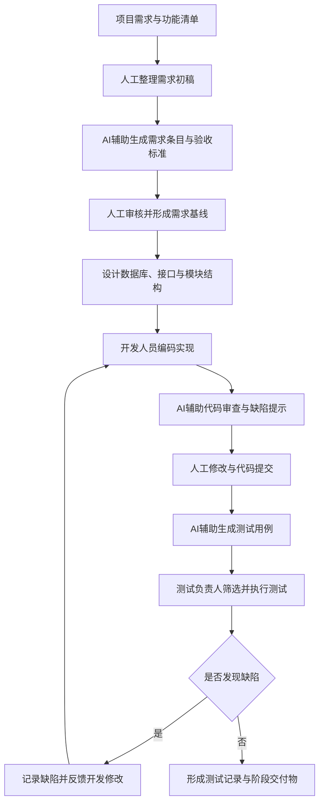

# 软件过程改进方案设计文档

## 1. 文档目的

本设计文档面向“考拉在线考试系统”的软件过程改进工作，目标是在原有需求定义、设计定义、实现与集成、验证测试、配置管理和项目监控等过程基础上，引入生成式 AI、智能代码分析、AI 辅助测试等技术，形成更高效、可验证、可落地的软件过程改进方案。

根据前一阶段《AI 技术调研与场景分析》的结论，本次不对所有生命周期环节平均展开，而是选择三个最适合课程项目落地的关键环节进行过程重构：

1. AI 辅助需求分析与一致性检查；
2. AI 辅助测试用例生成与测试覆盖优化；
3. AI 辅助代码审查与缺陷定位。

这三个环节分别对应需求阶段、测试阶段和实现阶段，既能体现 AI 对软件生命周期的支持，也便于在后续原型验证报告中选择一个场景进行实际验证。

## 2. 过程重构

针对已识别的三个关键环节，本文从“新增 AI 相关角色”“调整原有活动流程，融入 AI 工具执行节点”“定义 AI 输出物质量标准与验证机制”三个方面进行重构。

### 2.1 新增 AI 相关角色

| 角色名称 | 主要职责 | 参与阶段 |
|---|---|---|
| AI 协作负责人 | 负责选择 AI 工具、制定提示词规范、记录 AI 使用过程，确保 AI 参与过程可追踪 | 全过程 |
| AI 需求分析辅助员 | 使用 AI 工具辅助生成需求条目、用例描述、异常流程和验收标准，并对 AI 结果进行初步筛选 | 需求分析 |
| AI 测试分析师 | 使用 AI 工具根据需求说明生成测试用例，补充边界条件、异常场景和回归测试点 | 测试验证 |
| AI 代码审查员 | 使用 AI 工具辅助检查代码中的空指针、参数校验不足、权限遗漏、SQL 条件错误和接口不一致问题 | 编码实现 |
| 人工审核负责人 | 对 AI 输出结果进行最终确认，决定是否纳入正式文档、测试用例或代码修改清单 | 各阶段评审 |

这些角色不一定由独立成员担任，可以由现有的需求负责人、测试负责人、开发负责人兼任。角色调整的重点不是增加人员数量，而是明确 AI 工具使用、结果审核和责任归属，避免出现“AI 输出无人负责”的问题。

### 2.2 调整原有活动流程，融入 AI 工具执行节点

#### 2.2.1 需求分析过程改进

原有需求过程主要依赖人工整理需求、编写用例、检查功能边界。改进后，在需求文档初稿形成后增加 AI 辅助检查节点，用于发现需求遗漏、表述歧义和前后不一致问题。

改进后的需求活动流程如下：

1. 收集项目背景、用户角色和功能清单；
2. 人工整理需求初稿；
3. 使用 AI 工具生成候选需求条目、异常流程和验收标准；
4. AI 对需求文档进行一致性、完整性和可测试性检查；
5. 需求负责人筛选 AI 建议，修改需求文档；
6. 团队评审确认，形成需求基线。

该改进能够减少需求遗漏，尤其适用于登录、题库管理、试卷发布、考试提交、错题本、成绩查询等存在多种用户路径和异常情况的功能。

#### 2.2.2 测试验证过程改进

原有测试过程主要依赖人工根据需求设计测试用例，并手动执行回归测试。改进后，在测试用例设计阶段引入 AI 工具，根据需求描述自动生成测试用例初稿，并补充边界值、异常流和权限类用例。

改进后的测试活动流程如下：

1. 输入需求说明、功能流程和验收标准；
2. 人工列出核心功能测试点；
3. 使用 AI 工具生成测试用例初稿；
4. AI 辅助补充边界条件、异常场景和权限校验场景；
5. 测试负责人审核、删除不合理用例，补充项目特定数据；
6. 执行测试，记录通过情况和缺陷；
7. 根据缺陷结果更新回归测试用例。

该改进适合后续作为原型验证场景，因为测试用例数量、覆盖范围、设计耗时和有效用例比例都可以量化对比。

#### 2.2.3 编码实现过程改进

原有实现过程主要依靠成员分工编码、接口联调和人工 Debug。改进后，在代码提交前增加 AI 辅助代码审查节点，重点检查常见逻辑错误、接口参数不一致、权限控制遗漏和数据库查询条件问题。

改进后的编码活动流程如下：

1. 开发人员根据设计文档完成功能编码；
2. 本地运行并完成基本自测；
3. 使用 AI 工具进行代码片段审查和缺陷提示；
4. 开发人员根据 AI 建议修改代码；
5. 人工复查关键逻辑，避免盲目采纳 AI 建议；
6. 提交代码并进行前后端联调；
7. 发现缺陷后更新缺陷记录和经验清单。

该改进重点服务于课程项目中常见的接口联调问题，例如前后端字段不一致、SQL 多条件查询错误、权限判断遗漏、异常处理不足等。

### 2.3 改进后的总体流程图

### 2.4 定义 AI 输出物质量标准与验证机制

| AI 输出物 | 质量标准 | 验证机制 |
|---|---|---|
| AI 生成的需求条目 | 表述清晰，能对应具体用户角色和系统功能，不超出项目范围 | 需求负责人逐条审核，无法映射到系统功能的条目不采纳 |
| AI 生成的验收标准 | 可观察、可判断、可测试，避免模糊描述 | 与功能流程和测试用例交叉检查 |
| AI 生成的测试用例 | 包含前置条件、操作步骤、输入数据和预期结果 | 测试负责人执行可行性检查，统计有效用例比例 |
| AI 生成的代码审查建议 | 能指出具体代码位置、问题原因和修改方向 | 开发人员人工复核，确认后才允许修改代码 |
| AI 生成的缺陷分析说明 | 能解释缺陷触发条件和影响范围 | 与实际运行结果、接口返回和数据库记录对照验证 |

所有 AI 输出物均不得直接作为最终交付物，必须经过人工审核。AI 在本过程中的定位是辅助生成、辅助检查和辅助分析，最终决策仍由项目成员完成。

## 3. 工具链选型

| 改进环节 | 推荐工具或技术框架 | 核心功能 | 与现有过程的集成方式 | 预期效率提升指标 |
|---|---|---|---|---|
| 需求分析与一致性检查 | ChatGPT、Claude、Kimi、通义千问等大语言模型 | 需求条目生成、异常流程补充、验收标准生成、一致性检查 | 在需求初稿完成后，将功能说明输入 AI，生成修改建议，再由需求负责人筛选 | 需求检查时间减少约 30%；需求遗漏数量减少 |
| 测试用例生成与覆盖优化 | ChatGPT、GitHub Copilot Chat、Testin XAgent 等 | 根据需求生成测试用例，补充边界值、异常流和权限测试场景 | 在测试设计阶段输入功能描述和验收标准，生成测试用例表，再由测试人员审核执行 | 测试用例设计时间减少约 40%；边界和异常场景覆盖率提升 |
| 代码审查与缺陷定位 | GitHub Copilot、JetBrains AI、Cursor、SonarQube 等 | 代码解释、缺陷提示、重构建议、安全问题检查 | 在代码提交前进行 AI 审查，并结合人工 Code Review 形成修改清单 | 常见低级缺陷发现效率提升；联调问题定位时间减少约 30% |

工具链选型遵循三个原则：第一，优先选择成员容易使用的通用 AI 工具；第二，AI 工具必须嵌入现有文档、编码和测试流程，而不是单独形成新流程；第三，所有工具输出必须保留人工审核环节。

## 4. 风险评估与应对策略

| 风险类型 | 风险表现 | 应对策略 |
|---|---|---|
| 数据安全风险 | 将真实账号、数据库连接信息、隐私数据输入外部 AI 工具可能造成泄露 | 输入 AI 前进行脱敏处理，不提交真实密码、密钥、数据库连接串和学生隐私数据 |
| 模型幻觉风险 | AI 可能生成看似合理但项目中不存在的功能、接口或测试场景 | 要求所有 AI 输出必须能对应需求文档、设计文档或代码实现，无法对应则不采纳 |
| 质量责任不清 | 成员可能直接复制 AI 结果，导致错误进入正式交付物 | 设置人工审核负责人，规定 AI 输出只作为候选内容 |
| 技术依赖风险 | 过度依赖 AI，削弱成员对需求、代码和测试逻辑的理解 | 保留人工分析、评审和复盘环节，要求成员说明采纳或拒绝 AI 建议的理由 |
| 工具不可用风险 | 在线 AI 工具可能受网络、账号或额度限制影响 | 准备多个替代工具，核心过程仍可通过人工方式完成 |
| 版权与合规风险 | AI 生成代码或文本可能存在来源不清问题 | 对 AI 生成代码只采用思路，不直接复制大段未知来源代码；文档中保留参考文献 |

## 5. 小结

本方案围绕需求分析、测试验证和编码实现三个关键环节进行过程改进，重点不是简单增加 AI 工具，而是把 AI 纳入可管理的软件过程之中。通过新增 AI 相关角色、调整活动流程、设置 AI 工具执行节点、规定输出物质量标准和验证机制，可以在保持人工审核和责任清晰的前提下，提高需求检查、测试设计和缺陷定位效率。

在后续作业中，建议选择“AI 辅助测试用例生成与测试覆盖优化”作为原型验证场景。该场景输入材料明确、操作过程可复现、对比指标容易量化，能够较好支撑《AI 技术应用验证报告》的撰写。

## 参考文献

[1] DORA. Accelerate State of DevOps Report 2024. Google Cloud, 2024.

[2] DORA. State of AI-assisted Software Development 2025. Google Cloud, 2025.

[3] Stack Overflow. Stack Overflow Developer Survey 2025. Stack Overflow, 2025.

[4] GitHub. GitHub Copilot Documentation. GitHub Docs, 2024-2025.

[5] JetBrains. The State of Developer Ecosystem 2024. JetBrains, 2024.
